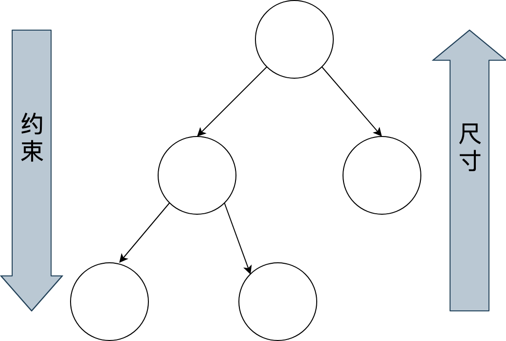
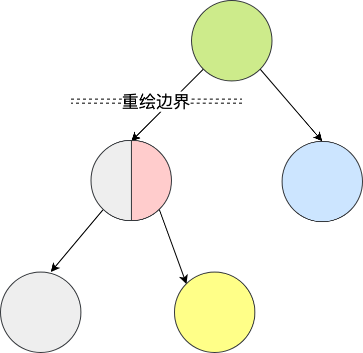
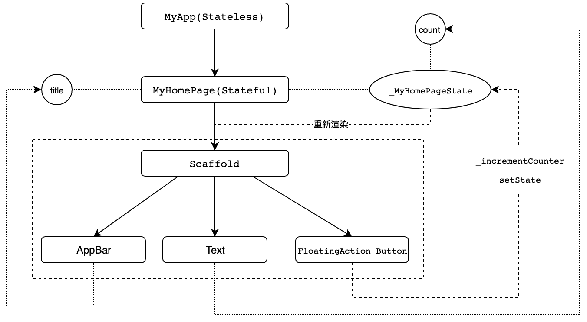
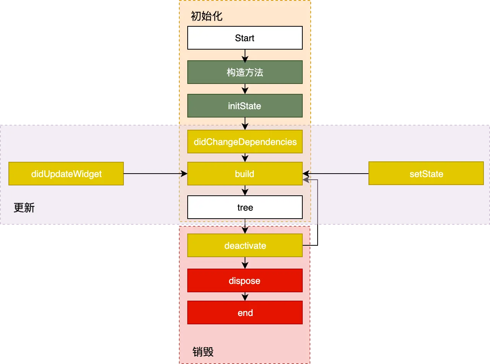
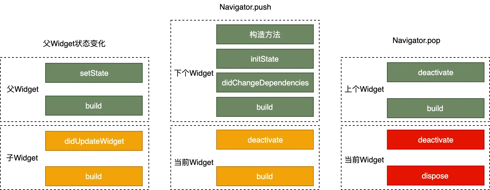
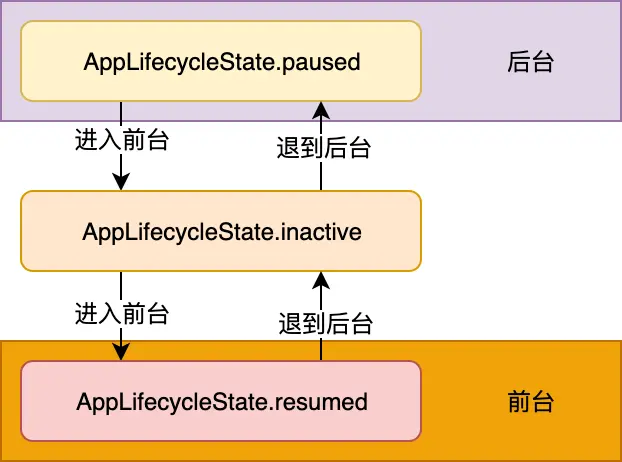

# flutter-learn

模仿微信，做了一个单机版的聊天，因为只有mac，没有Windows机器，以下仅根据mac来开发。也用electron做过这样一个[demo](https://github.com/spiderT/electron-learn)  


> web chrome 启动方法

配置环境

```text
flutter channel beta
flutter config --enable-web
```

项目启动

```text
cd flutterwebapp
flutter pub get
flutter create .
flutter run -d chrome
```

> macos桌面端应用，启动方法  

配置环境

```text
flutter channel dev
flutter config --enable-macos-desktop
```

项目启动

```text
cd flutterwebapp
flutter pub get
flutter create .
flutter run -d macOS
```

> websocket聊天

```text
cd server
node index.js
```

✅发文字  
✅发表情  
❎发文件——目前的库都是基于移动端选择相册图片，没有desktop选择文件  

- [flutter-learn](#flutter-learn)
  - [1. 在macOS上搭建Flutter开发环境](#1-在macos上搭建flutter开发环境)
    - [1.1. 获取Flutter SDK](#11-获取flutter-sdk)
      - [1.1.1. 运行 flutter doctor](#111-运行-flutter-doctor)
      - [1.1.2. 更新环境变量](#112-更新环境变量)
    - [1.2. iOS 设置](#12-ios-设置)
      - [1.2.1 安装 Xcode](#121-安装-xcode)
      - [1.2.2 设置iOS模拟器](#122-设置ios模拟器)
      - [1.2.3 安装到iOS设备](#123-安装到ios设备)
    - [1.3 Android设置](#13-android设置)
      - [1.3.1 Flutter需要安装和配置Android Studio:](#131-flutter需要安装和配置android-studio)
      - [1.3.2 设置您的Android设备](#132-设置您的android设备)
      - [1.3.3 设置Android模拟器](#133-设置android模拟器)
  - [2. flutter 核心技术](#2-flutter-核心技术)
    - [2.1 flutter 原理](#21-flutter-原理)
    - [2.2 flutter 界面渲染过程](#22-flutter-界面渲染过程)
  - [3. 生成应用](#3-生成应用)
    - [3.1. 方法](#31-方法)
      - [工程结构](#工程结构)
      - [工程代码](#工程代码)
      - [3.1.1 应用入口、应用结构以及页面结构，可以帮助你理解构建 Flutter 程序的基本结构和套路；](#311-应用入口应用结构以及页面结构可以帮助你理解构建-flutter-程序的基本结构和套路)
      - [3.1.2 应用结构](#312-应用结构)
    - [3.2. 路由管理](#32-路由管理)
    - [3.3. 包管理](#33-包管理)
      - [3.3.1. Pub仓库](#331-pub仓库)
      - [3.3.2. 其它依赖方式](#332-其它依赖方式)
    - [3.4. 资源管理](#34-资源管理)
      - [3.4.1. 指定 assets](#341-指定-assets)
      - [3.4.2. Asset 变体（variant）](#342-asset-变体variant)
      - [3.4.3. 加载 assets](#343-加载-assets)
        - [加载文本assets](#加载文本assets)
      - [3.4.4. 加载图片](#344-加载图片)
        - [声明分辨率相关的图片 assets](#声明分辨率相关的图片-assets)
        - [加载图片](#加载图片)
        - [依赖包中的资源图片](#依赖包中的资源图片)
        - [打包包中的 assets](#打包包中的-assets)
      - [3.4.5. 特定平台 assets](#345-特定平台-assets)
        - [设置APP图标](#设置app图标)
  - [4. 生命周期](#4-生命周期)
    - [4.1. State 生命周期](#41-state-生命周期)
      - [4.1.1. 创建](#411-创建)
      - [4.1.2. 更新](#412-更新)
      - [4.1.3. 销毁](#413-销毁)
    - [4.2. App 生命周期](#42-app-生命周期)
      - [4.2.1. 生命周期回调](#421-生命周期回调)
      - [4.4.2. 帧绘制回调](#442-帧绘制回调)
  - [5. 基础组件](#5-基础组件)
    - [5.1. Widget简介](#51-widget简介)
      - [5.1.1. 概念](#511-概念)
      - [5.1.2. Widget与Element](#512-widget与element)
      - [5.1.3. Widget主要接口](#513-widget主要接口)
      - [5.1.4. StatelessWidget](#514-statelesswidget)
        - [Context](#context)
      - [5.1.5. StatefulWidget](#515-statefulwidget)
    - [5.2. 文本及样式](#52-文本及样式)
      - [5.2.1. Text](#521-text)
      - [5.2.2. TextStyle](#522-textstyle)
      - [5.2.3. TextSpan](#523-textspan)
      - [5.2.4. DefaultTextStyle](#524-defaulttextstyle)
      - [5.2.5. 字体](#525-字体)
        - [在asset中声明](#在asset中声明)
        - [使用字体](#使用字体)
        - [Package中的字体](#package中的字体)
    - [5.3. 按钮](#53-按钮)
      - [5.3.1. Material组件库中的按钮](#531-material组件库中的按钮)
        - [RaisedButton](#raisedbutton)
        - [FlatButton](#flatbutton)
        - [OutlineButton](#outlinebutton)
        - [IconButton](#iconbutton)
        - [带图标的按钮](#带图标的按钮)
      - [5.3.2. 自定义按钮外观](#532-自定义按钮外观)
    - [5.4. 图片及ICON](#54-图片及icon)
      - [5.4.1. 图片](#541-图片)
        - [ImageProvider](#imageprovider)
        - [Image](#image)
        - [从asset中加载图片](#从asset中加载图片)
        - [参数](#参数)
      - [5.4.2. icon](#542-icon)
        - [使用Material Design字体图标](#使用material-design字体图标)
        - [使用自定义字体图标](#使用自定义字体图标)
    - [5.5. 单选开关和复选框](#55-单选开关和复选框)
          - [属性及外观](#属性及外观)
    - [5.6. 输入框及表单](#56-输入框及表单)
      - [5.6.1. TextField](#561-textfield)
      - [5.6.2. 表单Form](#562-表单form)
    - [5.7. 进度指示器](#57-进度指示器)
      - [LinearProgressIndicator](#linearprogressindicator)
      - [CircularProgressIndicator](#circularprogressindicator)
      - [自定义尺寸](#自定义尺寸)
      - [进度色动画](#进度色动画)
      - [自定义进度指示器样式](#自定义进度指示器样式)
  - [6. 跨组件传递数据](#6-跨组件传递数据)
    - [6.1. InheritedWidget](#61-inheritedwidget)
    - [6.2. Notification](#62-notification)
    - [6.3. EventBus](#63-eventbus)
  - [7. 定制不同风格的App主题](#7-定制不同风格的app主题)
  - [8. 本地存储与数据库的使用](#8-本地存储与数据库的使用)
  - [9. http 请求](#9-http-请求)
    - [9.1. 通过HttpClient发起HTTP请求](#91-通过httpclient发起http请求)
  - [10. websocket](#10-websocket)
    - [10.1. 连接到WebSocket服务器](#101-连接到websocket服务器)
    - [10.2. 监听来自服务器的消息](#102-监听来自服务器的消息)
    - [10.3. 将数据发送到服务器](#103-将数据发送到服务器)
    - [10.4. 关闭WebSocket连接](#104-关闭websocket连接)
    - [10.5. 使用Socket API](#105-使用socket-api)
  - [11. flutter web](#11-flutter-web)
  - [12. flutter desktop](#12-flutter-desktop)
    - [12.1. macOS](#121-macos)
      - [12.1.1. 配置环境](#1211-配置环境)
      - [12.1.2. 打包](#1212-打包)
  - [13. 测试和调试](#13-测试和调试)
    - [13.1. 调试工具](#131-调试工具)
    - [13.2. 以编程方式调试应用](#132-以编程方式调试应用)
      - [13.2.1. 日志输出](#1321-日志输出)
      - [13.2.2. 设置断点](#1322-设置断点)
      - [13.2.3. Debug 标识：应用程序层](#1323-debug-标识应用程序层)
        - [13.2.3.1. Widget 树](#13231-widget-树)
        - [13.2.3.2. Render 树](#13232-render-树)
        - [13.2.3.3. Layer 树](#13233-layer-树)
        - [13.2.3.4. Semantics 树](#13234-semantics-树)
        - [13.2.3.5. Scheduling](#13235-scheduling)
    - [13.2.4. 调试标志：布局](#1324-调试标志布局)
    - [13.2.5. 调试动画](#1325-调试动画)
    - [13.2.6. 调试标志：性能](#1326-调试标志性能)
      - [13.2.6.1. 跟踪 Dart 代码性能](#13261-跟踪-dart-代码性能)
    - [13.2.7. Widget 对齐网格](#1327-widget-对齐网格)
  - [14. 自动化测试](#14-自动化测试)
    - [14.1. 单元测试](#141-单元测试)
    - [14.2. UI 测试](#142-ui-测试)

## 1. 在macOS上搭建Flutter开发环境

### 1.1. 获取Flutter SDK

[去flutter官网下载其最新可用的安装包](https://flutter.io/sdk-archive/#macos) 。

```text
cd ~/development
unzip ~/Downloads/flutter_macos_v0.5.1-beta.zip
```

添加flutter相关工具到path中：

```text
export PATH=`pwd`/flutter/bin:$PATH
```

#### 1.1.1. 运行 flutter doctor

该命令检查您的环境并在终端窗口中显示报告。Dart SDK已经在捆绑在Flutter里了，没有必要单独安装Dart。 仔细检查命令行输出以获取可能需要安装的其他软件或进一步需要执行的任

#### 1.1.2. 更新环境变量

1. 确定您Flutter SDK的目录，您将在步骤3中用到。
2. 打开(或创建) $HOME/.bash_profile. 文件路径和文件名可能在您的机器上不同.
3. 添加以下行并更改[PATH_TO_FLUTTER_GIT_DIRECTORY]为克隆Flutter的git repo的路径:

```text
export PUB_HOSTED_URL=https://pub.flutter-io.cn //国内用户需要设置
export FLUTTER_STORAGE_BASE_URL=https://storage.flutter-io.cn //国内用户需要设置
export PATH= PATH_TO_FLUTTER_GIT_DIRECTORY/flutter/bin:$PATH
```

注意：PATH_TO_FLUTTER_GIT_DIRECTORY 为你flutter的路径，比如“~/document/code”

```text
export PATH= ~/document/code/flutter/bin:$PATH
```

4. 运行 source $HOME/.bash_profile 刷新当前终端窗口.  

**注意**: 如果你使用的是zsh，终端启动时 ~/.bash_profile 将不会被加载，解决办法就是修改 ~/.zshrc ，在其中添加：source ~/.bash_profile

5. 通过运行flutter/bin命令验证目录是否在已经在PATH中:

```text
echo $PATH
```

### 1.2. iOS 设置

#### 1.2.1 安装 Xcode

1. 要为iOS开发Flutter应用程序，您需要Xcode 7.2或更高版本:

2. 安装Xcode 7.2或更新版本.

配置Xcode命令行工具以使用新安装的Xcode版本 sudo xcode-select --switch /Applications/Xcode.app/Contents/Developer 对于大多数情况，当您想要使用最新版本的Xcode时，这是正确的路径。如果您需要使用不同的版本，请指定相应路径。

3. 确保Xcode许可协议是通过打开一次Xcode或通过命令sudo xcodebuild -license同意过了.

使用Xcode，您可以在iOS设备或模拟器上运行Flutter应用程序。

#### 1.2.2 设置iOS模拟器

1. 要准备在iOS模拟器上运行并测试您的Flutter应用，请按以下步骤操作：

在Mac上，通过Spotlight或使用以下命令找到模拟器:

```text
open -a Simulator
```

2. 通过检查模拟器 硬件>设备 菜单中的设置，确保您的模拟器正在使用64位设备（iPhone 5s或更高版本）.
3. 根据您的开发机器的屏幕大小，模拟的高清屏iOS设备可能会使您的屏幕溢出。在模拟器的 Window> Scale 菜单下设置设备比例
4. 运行 flutter run启动您的应用.

#### 1.2.3 安装到iOS设备

要将您的Flutter应用安装到iOS真机设备，您需要一些额外的工具和一个Apple帐户，您还需要在Xcode中进行设置。

1. 安装 homebrew （如果已经安装了brew,跳过此步骤）.
2. 打开终端并运行这些命令来安装用于将Flutter应用安装到iOS设备的工具

```text
brew update
brew install --HEAD usbmuxd
brew link usbmuxd
brew install --HEAD libimobiledevice
brew install ideviceinstaller
```

usbmuxd 是一个与 iOS 设备建立多路通信连接的 socket 守护进程，通过它，可以将 USB 通信抽象为 TCP 通信；libimobiledevice 是一个与 iOS 设备进行通信的跨平台协议库；而 ideviceinstaller 则是一个使用它们在 iOS 设备上管理 App 的工具。  

> 进行 Xcode 签名配置

项目中的ios/Runner.xcworkspace，在 Xcode 中，选择导航面板左侧最上方的 Runner 项目。  

在 General > Signing > Team 中，我们需要配置一下开发团队，也就是用你的 Apple ID 登录 Xcode。当配置完成时，Xcode 会自动创建并下载开发证书。任意 Apple ID 都支持开发和测试，但如果想将应用发布到 App Store，则必须加入 Apple 开发者计划。开发者计划的详细信息，你可以通过苹果官方的compare memberships了解.  

### 1.3 Android设置

#### 1.3.1 Flutter需要安装和配置Android Studio:

1. 下载并安装 Android Studio.

2. 启动Android Studio，然后执行“Android Studio安装向导”。这将安装最新的Android SDK，Android SDK平台工具和Android SDK构建工具，这是Flutter为Android开发时所必需的

#### 1.3.2 设置您的Android设备

要准备在Android设备上运行并测试您的Flutter应用，需要安装Android 4.1（API level 16）或更高版本的Android设备.

1. 在您的设备上启用 开发人员选项 和 USB调试 。详细说明可在Android文档中找到。
2. 使用USB将手机插入电脑。如果您的设备出现提示，请授权您的计算机访问您的设备。
3. 在终端中，运行 flutter devices 命令以验证Flutter识别您连接的Android设备。
4. 运行启动您的应用程序 flutter run。
默认情况下，Flutter使用的Android SDK版本是基于你的 adb 工具版本。 如果您想让Flutter使用不同版本的Android SDK，则必须将该 ANDROID_HOME 环境变量设置为SDK安装目录。

#### 1.3.3 设置Android模拟器

要准备在Android模拟器上运行并测试您的Flutter应用，请按照以下步骤操作：

1. 在您的机器上启用 VM acceleration .
2. 启动 Android Studio>Tools>Android>AVD Manager 并选择 Create Virtual Device.
3. 选择一个设备并选择 Next。
4. 为要模拟的Android版本选择一个或多个系统映像，然后选择 Next. 建议使用 x86 或 x86_64 image .
5. 在 Emulated Performance下, 选择 Hardware - GLES 2.0 以启用 硬件加速.
6. 验证AVD配置是否正确，然后选择 Finish。
7. 在 Android Virtual Device Manager中, 点击工具栏的 Run。模拟器启动并显示所选操作系统版本或设备的启动画面.
8. 运行 flutter run 启动您的设备. 连接的设备名是 Android SDK built for <platform>,其中 platform 是芯片系列, 如 x86.

## 2. flutter 核心技术

Flutter 是构建 Google 物联网操作系统 Fuchsia 的 SDK，主打跨平台、高保真、高性能。开发者可以通过 Dart 语言开发 App，一套代码可以同时运行在 iOS 和 Android 平台。 Flutter 使用 Native 引擎渲染视图，并提供了丰富的组件和接口，这无疑为开发者和用户都提供了良好的体验。

1. 与用于构建移动应用程序的其他大多数框架不同，Flutter 是重写了一整套包括底层渲染逻辑和上层开发语言的完整解决方案。这样不仅可以保证视图渲染在 Android 和 iOS 上的高度一致性（即高保真），在代码执行效率和渲染性能上也可以媲美原生 App 的体验（即高性能）。

2. 可以看到，Flutter 关注如何尽可能快地在两个硬件时钟的 VSync 信号之间计算并合成视图数据，然后通过 Skia 交给 GPU 渲染：UI 线程使用 Dart 来构建视图结构数据，这些数据会在 GPU 线程进行图层合成，随后交给 Skia 引擎加工成 GPU 数据，而这些数据会通过 OpenGL 最终提供给 GPU 渲染。


3. Skia 是一款用 C++ 开发的、性能彪悍的 2D 图像绘制引擎，其前身是一个向量绘图软件。2005 年被 Google 公司收购后，因为其出色的绘制表现被广泛应用在 Chrome 和 Android 等核心产品上。Skia 在图形转换、文字渲染、位图渲染方面都表现卓越，并提供了开发者友好的 API。

4. Dart

+ Dart 同时支持即时编译 JIT 和事前编译 AOT。在开发期使用 JIT，开发周期异常短，调试方式颠覆常规（支持有状态的热重载）；而发布期使用 AOT，本地代码的执行更高效，代码性能和用户体验也更卓越。

+ Dart 作为一门现代化语言，集百家之长，拥有其他优秀编程语言的诸多特性（比如，完善的包管理机制）。也正是这个原因，Dart 的学习成本并不高，很容易上手。

+ Dart 避免了抢占式调度和共享内存，可以在没有锁的情况下进行对象分配和垃圾回收，在性能方面表现相当不错。

### 2.1 flutter 原理


Flutter 架构采用分层设计，从下到上分为三层，依次为：Embedder、Engine、Framework。

1. Embedder 是操作系统适配层，实现了渲染 Surface 设置，线程设置，以及平台插件等平台相关特性的适配。从这里我们可以看到，Flutter 平台相关特性并不多，这就使得从框架层面保持跨端一致性的成本相对较低。

2. Engine 层主要包含 Skia、Dart 和 Text，实现了 Flutter 的渲染引擎、文字排版、事件处理和 Dart 运行时等功能。Skia 和 Text 为上层接口提供了调用底层渲染和排版的能力，Dart 则为 Flutter 提供了运行时调用 Dart 和渲染引擎的能力。而 Engine 层的作用，则是将它们组合起来，从它们生成的数据中实现视图渲染。

3. Framework 层则是一个用 Dart 实现的 UI SDK，包含了动画、图形绘制和手势识别等功能。为了在绘制控件等固定样式的图形时提供更直观、更方便的接口，Flutter 还基于这些基础能力，根据 Material 和 Cupertino 两种视觉设计风格封装了一套 UI 组件库。我们在开发 Flutter 的时候，可以直接使用这些组件库。

### 2.2 flutter 界面渲染过程

页面中的各界面元素（Widget）以树的形式组织，即控件树。Flutter 通过控件树中的每个控件创建不同类型的渲染对象，组成渲染对象树。而渲染对象树在 Flutter 的展示过程分为四个阶段：布局、绘制、合成和渲染。

1. 布局

Flutter 采用深度优先机制遍历渲染对象树，决定渲染对象树中各渲染对象在屏幕上的位置和尺寸。在布局过程中，渲染对象树中的每个渲染对象都会接收父对象的布局约束参数，决定自己的大小，然后父对象按照控件逻辑决定各个子对象的位置，完成布局过程。



为了防止因子节点发生变化而导致整个控件树重新布局，Flutter 加入了一个机制——布局边界（Relayout Boundary），可以在某些节点自动或手动地设置布局边界，当边界内的任何对象发生重新布局时，不会影响边界外的对象，反之亦然。


2. 绘制

布局完成后，渲染对象树中的每个节点都有了明确的尺寸和位置。Flutter 会把所有的渲染对象绘制到不同的图层上。与布局过程一样，绘制过程也是深度优先遍历，而且总是先绘制自身，再绘制子节点。

以下图为例：节点 1 在绘制完自身后，会再绘制节点 2，然后绘制它的子节点 3、4 和 5，最后绘制节点 6。


可以看到，由于一些其他原因（比如，视图手动合并）导致 2 的子节点 5 与它的兄弟节点 6 处于了同一层，这样会导致当节点 2 需要重绘的时候，与其无关的节点 6 也会被重绘，带来性能损耗。为了解决这一问题，Flutter 提出了与布局边界对应的机制——重绘边界（Repaint Boundary）。在重绘边界内，Flutter 会强制切换新的图层，这样就可以避免边界内外的互相影响，避免无关内容置于同一图层引起不必要的重绘。



重绘边界的一个典型场景是 Scrollview。ScrollView 滚动的时候需要刷新视图内容，从而触发内容重绘。而当滚动内容重绘时，一般情况下其他内容是不需要重绘的，这时候重绘边界就派上用场了。

3. 合成和渲染

终端设备的页面越来越复杂，因此 Flutter 的渲染树层级通常很多，直接交付给渲染引擎进行多图层渲染，可能会出现大量渲染内容的重复绘制，所以还需要先进行一次图层合成，即将所有的图层根据大小、层级、透明度等规则计算出最终的显示效果，将相同的图层归类合并，简化渲染树，提高渲染效率。合并完成后，Flutter 会将几何图层数据交由 Skia 引擎加工成二维图像数据，最终交由 GPU 进行渲染，完成界面的展示。


## 3. 生成应用

### 3.1. 方法

1. 命令行生成应用

```text
flutter create myapp
```

2. vscode 生成

+ 启动 VS Code
+ 调用 View>Command Palette…
+ 输入 ‘flutter’, 然后选择 ‘Flutter: New Project’ action
+ 输入 Project 名称 (如myapp), 然后按回车键
+ 指定放置项目的位置，然后按蓝色的确定按钮
+ 等待项目创建继续，并显示main.dart文件

#### 工程结构


除了 Flutter 本身的代码、资源、依赖和配置之外，Flutter 工程还包含了 Android 和 iOS 的工程目录。这也不难理解，因为 Flutter 虽然是跨平台开发方案，但却需要一个容器最终运行到 Android 和 iOS 平台上，所以 Flutter 工程实际上就是一个同时内嵌了 Android 和 iOS 原生子工程的父工程：我们在 lib 目录下进行 Flutter 代码的开发，而某些特殊场景下的原生功能，则在对应的 Android 和 iOS 工程中提供相应的代码实现，供对应的 Flutter 代码引用。Flutter 会将相关的依赖和构建产物注入这两个子工程，最终集成到各自的项目中。而我们开发的 Flutter 代码，最终则会以原生工程的形式运行。

#### 工程代码

#### 3.1.1 应用入口、应用结构以及页面结构，可以帮助你理解构建 Flutter 程序的基本结构和套路；

1. 导入包。

```dart
import 'package:flutter/material.dart';
```

此行代码作用是导入了Material UI组件库。Material是一种标准的移动端和web端的视觉设计语言， Flutter默认提供了一套丰富的Material风格的UI组件。

2. 应用入口。

```dart
void main() => runApp(MyApp());
```

与C/C++、Java类似，Flutter 应用中main函数为应用程序的入口。main函数中调用了runApp 方法，它的功能是启动Flutter应用。runApp它接受一个Widget参数，在本示例中它是一个MyApp对象，MyApp()是Flutter应用的根组件。
main函数使用了(=>)符号，这是Dart中单行函数或方法的简写。

3. 应用结构。

```dart
class MyApp extends StatelessWidget {
  @override
  Widget build(BuildContext context) {
    return new MaterialApp(
      //应用名称  
      title: 'Flutter Demo', 
      theme: new ThemeData(
        //蓝色主题  
        primarySwatch: Colors.blue,
      ),
      //应用首页路由  
      home: new MyHomePage(title: 'Flutter Demo Home Page'),
    );
  }
}
```

+ Flutter 应用为 MyApp 类的一个实例，而 MyApp 类继承自 StatelessWidget 类，这也就意味着应用本身也是一个 Widget。事实上，在 Flutter 中，Widget 是整个视图描述的基础，在 Flutter 的世界里，包括应用、视图、视图控制器、布局等在内的概念，都建立在 Widget 之上，Flutter 的核心设计思想便是一切皆 Widget。

+ Widget 是组件视觉效果的封装，是 UI 界面的载体，因此我们还需要为它提供一个方法，来告诉 Flutter 框架如何构建 UI 界面，这个方法就是 build。

+ 在 build 方法中，我们通常通过对基础 Widget 进行相应的 UI 配置，或是组合各类基础 Widget 的方式进行 UI 的定制化。比如在 MyApp 中，我通过 MaterialApp 这个 Flutter App 框架设置了应用首页，即 MyHomePage。当然，MaterialApp 也是一个 Widget。

+ MaterialApp 类是对构建 material 设计风格应用的组件封装框架，里面还有很多可配置的属性，比如应用主题、应用名称、语言标识符、组件路由等。但是，这些配置属性并不是本次分享的重点，如果你感兴趣的话，可以参考 Flutter 官方的API 文档，来了解 MaterialApp 框架的其他配置能力。

#### 3.1.2 应用结构



```js
class MyHomePage extends StatefulWidget {
     MyHomePage({Key key, this.title}) : super(key: key);
     final String title;
     @override
     _MyHomePageState createState() => new _MyHomePageState();
   }

   class _MyHomePageState extends State<MyHomePage> {
    ...
   }
```

1. MyHomePage 是Flutter应用的首页，它继承自StatefulWidget类，表示它是一个有状态的组件（Stateful widget）。关于Stateful widget我们将在第三章“Widget简介”一节仔细介绍，现在我们只需简单认为有状态的组件（Stateful widget） 和无状态的组件（Stateless widget）有两点不同：

2. Stateful widget可以拥有状态，这些状态在widget生命周期中是可以变的，而Stateless widget是不可变的。

Stateful widget至少由两个类组成：

+ 一个StatefulWidget类。
+ 一个 State类； StatefulWidget类本身是不变的，但是State类中持有的状态在widget生命周期中可能会发生变化。

_MyHomePageState类是MyHomePage类对应的状态类。看到这里，读者可能已经发现：和MyApp 类不同， MyHomePage类中并没有build方法，取而代之的是，build方法被挪到了_MyHomePageState方法中，至于为什么这么做，先留个疑问，在分析完完整代码后再来解答。

3. State类

该组件的状态。由于我们只需要维护一个点击次数计数器，所以定义一个_counter状态：

```dart
int _counter = 0; //用于记录按钮点击的总次数
```

_counter 为保存屏幕右下角带“+”号按钮点击次数的状态。

设置状态的自增函数。

```dart
void _incrementCounter() {
  setState(() {
     _counter++;
  });
}
```

当按钮点击时，会调用此函数，该函数的作用是先自增_counter，然后调用setState 方法。setState方法的作用是通知Flutter框架，有状态发生了改变，Flutter框架收到通知后，会执行build方法来根据新的状态重新构建界面， Flutter 对此方法做了优化，使重新执行变的很快，所以你可以重新构建任何需要更新的东西，而无需分别去修改各个widget。

3. 构建UI界面

构建UI界面的逻辑在build方法中，当MyHomePage第一次创建时，_MyHomePageState类会被创建，当初始化完成后，Flutter框架会调用Widget的build方法来构建widget树，最终将widget树渲染到设备屏幕上。所以，我们看看_MyHomePageState的build方法中都干了什么事：

```dart
Widget build(BuildContext context) {
    return new Scaffold(
      appBar: new AppBar(
        title: new Text(widget.title),
      ),
      body: new Center(
        child: new Column(
          mainAxisAlignment: MainAxisAlignment.center,
          children: <Widget>[
            new Text(
              'You have pushed the button this many times:',
            ),
            new Text(
              '$_counter',
              style: Theme.of(context).textTheme.display1,
            ),
          ],
        ),
      ),
      floatingActionButton: new FloatingActionButton(
        onPressed: _incrementCounter,
        tooltip: 'Increment',
        child: new Icon(Icons.add),
      ),
    );
  }
```

- Scaffold 是 Material组件库中提供的一个组件，它提供了默认的导航栏、标题和包含主屏幕widget树（后同“组件树”或“部件树”）的body属性。组件树可以很复杂。

- body的组件树中包含了一个Center 组件，Center 可以将其子组件树对齐到屏幕中心。此例中， Center 子组件是一个Column 组件，Column的作用是将其所有子组件沿屏幕垂直方向依次排列； 此例中Column子组件是两个 Text，第一个Text 显示固定文本 “You have pushed the button this many times:”，第二个Text 显示_counter状态的数值。

- floatingActionButton是页面右下角的带“+”的悬浮按钮，它的onPressed属性接受一个回调函数，代表它被点击后的处理器，本例中直接将_incrementCounter方法作为其处理函数。

- 现在，我们将整个计数器执行流程串起来：当右下角的floatingActionButton按钮被点击之后，会调用_incrementCounter方法。在_incrementCounter方法中，首先会自增_counter计数器（状态），然后setState会通知Flutter框架状态发生变化，接着，Flutter框架会调用build方法以新的状态重新构建UI，最终显示在设备屏幕上。

- 为什么要将build方法放在State中，而不是放在StatefulWidget中？
现在，我们回答之前提出的问题，为什么build()方法放在State（而不是StatefulWidget）中 ？这主要是为了提高开发的灵活性。如果将build()方法放在StatefulWidget中则会有两个问题：

1. 状态访问不便

试想一下，如果我们的StatefulWidget有很多状态，而每次状态改变都要调用build方法，由于状态是保存在State中的，如果build方法在StatefulWidget中，那么build方法和状态分别在两个类中，那么构建时读取状态将会很不方便！试想一下，如果真的将build方法放在StatefulWidget中的话，由于构建用户界面过程需要依赖State，所以build方法将必须加一个State参数，大概是下面这样：

```dart
  Widget build(BuildContext context, State state){
      //state.counter
      ...
  }
```

这样的话就只能将State的所有状态声明为公开的状态，这样才能在State类外部访问状态！但是，将状态设置为公开后，状态将不再具有私密性，这就会导致对状态的修改将会变的不可控。但如果将build()方法放在State中的话，构建过程不仅可以直接访问状态，而且也无需公开私有状态，这会非常方便。

2. 继承StatefulWidget不便

例如，Flutter中有一个动画widget的基类AnimatedWidget，它继承自StatefulWidget类。AnimatedWidget中引入了一个抽象方法build(BuildContext context)，继承自AnimatedWidget的动画widget都要实现这个build方法。现在设想一下，如果StatefulWidget 类中已经有了一个build方法，正如上面所述，此时build方法需要接收一个state对象，这就意味着AnimatedWidget必须将自己的State对象(记为_animatedWidgetState)提供给其子类，因为子类需要在其build方法中调用父类的build方法，代码可能如下：

```dart
class MyAnimationWidget extends AnimatedWidget{
    @override
    Widget build(BuildContext context, State state){
      //由于子类要用到AnimatedWidget的状态对象_animatedWidgetState，
      //所以AnimatedWidget必须通过某种方式将其状态对象_animatedWidgetState
      //暴露给其子类   
      super.build(context, _animatedWidgetState)
    }
}
```

这样很显然是不合理的，因为AnimatedWidget的状态对象是AnimatedWidget内部实现细节，不应该暴露给外部。
如果要将父类状态暴露给子类，那么必须得有一种传递机制，而做这一套传递机制是无意义的，因为父子类之间状态的传递和子类本身逻辑是无关的。
综上所述，可以发现，对于StatefulWidget，将build方法放在State中，可以给开发带来很大的灵活性。

### 3.2. 路由管理

flutter中的路由管理和原生开发类似，无论是Android还是iOS，导航管理都会维护一个路由栈，路由入栈(push)操作对应打开一个新页面，路由出栈(pop)操作对应页面关闭操作  

### 3.3. 包管理

flutter使用配置文件pubspec.yaml（位于项目根目录）来管理第三方依赖包。  

YAML是一种直观、可读性高并且容易被人类阅读的文件格式，它和xml或Json相比，它语法简单并非常容易解析，所以YAML常用于配置文件，Flutter也是用yaml文件作为其配置文件。Flutter项目默认的配置文件是pubspec.yaml  

```yaml
name: flutter_in_action
description: First Flutter application.

version: 1.0.0+1

dependencies:
  flutter:
    sdk: flutter
  cupertino_icons: ^0.1.2

dev_dependencies:
  flutter_test:
    sdk: flutter

flutter:
  uses-material-design: true
```

各个字段的意义：  

- name：应用或包名称。  
- description: 应用或包的描述、简介。  
- version：应用或包的版本号。  
- dependencies：应用或包依赖的其它包或插件。  
- dev_dependencies：开发环境依赖的工具包（而不是flutter应用本身依赖的包）。  
- flutter：flutter相关的配置选项。  

如果我们的Flutter应用本身依赖某个包，我们需要将所依赖的包添加到dependencies 下  

#### 3.3.1. Pub仓库

Pub（https://pub.dev/ ）是Google官方的Dart Packages仓库，类似于node中的npm仓库，android中的jcenter。我们可以在Pub上面查找我们需要的包和插件，也可以向Pub发布我们的包和插件。我们将在后面的章节中介绍如何向Pub发布我们的包和插件。  

我们实现一个显示随机字符串的widget。有一个名为“english_words”的开源软件包，其中包含数千个常用的英文单词以及一些实用功能。我们首先在pub上找到english_words这个包.  

1. 将“english_words”（3.1.3版本）添加到依赖项列表，如下：  

```yaml
dependencies:
  flutter:
    sdk: flutter

  cupertino_icons: ^0.1.0
  # 新添加的依赖
  english_words: ^3.1.3
```

2. 下载包，运行flutter pub get

3. 引入english_words包。

```dart
import 'package:english_words/english_words.dart';
```

#### 3.3.2. 其它依赖方式

- 依赖本地包  

如果我们正在本地开发一个包，包名为pkg1，我们可以通过下面方式依赖：  

```yaml
dependencies:
    pkg1:
        path: ../../code/pkg1
```

路径可以是相对的，也可以是绝对的。  

- 依赖Git：你也可以依赖存储在Git仓库中的包。如果软件包位于仓库的根目录中，请使用以下语法  

```yaml
dependencies:
  pkg1:
    git:
      url: git://github.com/xxx/pkg1.git
```

上面假定包位于Git存储库的根目录中。如果不是这种情况，可以使用path参数指定相对位置，例如：  

```yaml
dependencies:
  package1:
    git:
      url: git://github.com/flutter/packages.git
      path: packages/package1
```

### 3.4. 资源管理

Flutter APP安装包中会包含代码和 assets（资源）两部分。Assets是会打包到程序安装包中的，可在运行时访问。常见类型的assets包括静态数据（例如JSON文件）、配置文件、图标和图片（JPEG，WebP，GIF，动画WebP / GIF，PNG，BMP和WBMP）等。  

#### 3.4.1. 指定 assets

和包管理一样，Flutter也使用pubspec.yaml文件来管理应用程序所需的资源，举个例子:

```yaml
flutter:
  assets:
    - assets/my_icon.png
    - assets/background.png
```

assets指定应包含在应用程序中的文件， 每个asset都通过相对于pubspec.yaml文件所在的文件系统路径来标识自身的路径。asset的声明顺序是无关紧要的，asset的实际目录可以是任意文件夹（在本示例中是assets文件夹）。  

在构建期间，Flutter将asset放置到称为 asset bundle 的特殊存档中，应用程序可以在运行时读取它们（但不能修改）。   

#### 3.4.2. Asset 变体（variant）

构建过程支持“asset变体”的概念：不同版本的asset可能会显示在不同的上下文中。 在pubspec.yaml的assets部分中指定asset路径时，构建过程中，会在相邻子目录中查找具有相同名称的任何文件。这些文件随后会与指定的asset一起被包含在asset bundle中。  

例如，如果应用程序目录中有以下文件:  

…/pubspec.yaml  
…/graphics/my_icon.png  
…/graphics/background.png  
…/graphics/dark/background.png  
…etc.  
然后pubspec.yaml文件中只需包含:  

```yaml
flutter:
  assets:
    - graphics/background.png
```

那么这两个graphics/background.png和graphics/dark/background.png 都将包含在您的asset bundle中。前者被认为是main asset （主资源），后者被认为是一种变体（variant）。

在选择匹配当前设备分辨率的图片时，Flutter会使用到asset变体（见下文），将来，Flutter可能会将这种机制扩展到本地化、阅读提示等方面。

#### 3.4.3. 加载 assets

可以通过AssetBundle对象访问其asset 。有两种主要方法允许从Asset bundle中加载字符串或图片（二进制）文件。

##### 加载文本assets

- 通过rootBundle 对象加载：每个Flutter应用程序都有一个rootBundle对象， 通过它可以轻松访问主资源包，直接使用package:flutter/services.dart中全局静态的rootBundle对象来加载asset即可。  

- 通过 DefaultAssetBundle 加载：建议使用 DefaultAssetBundle 来获取当前BuildContext的AssetBundle。 这种方法不是使用应用程序构建的默认asset bundle，而是使父级widget在运行时动态替换的不同的AssetBundle，这对于本地化或测试场景很有用。  

通常，可以使用DefaultAssetBundle.of()在应用运行时来间接加载asset（例如JSON文件），而在widget上下文之外，或其它AssetBundle句柄不可用时，可以使用rootBundle直接加载这些asset，例如：  

```dart
import 'dart:async' show Future;
import 'package:flutter/services.dart' show rootBundle;

Future<String> loadAsset() async {
  return await rootBundle.loadString('assets/config.json');
}
```

#### 3.4.4. 加载图片  

类似于原生开发，Flutter也可以为当前设备加载适合其分辨率的图像。  

##### 声明分辨率相关的图片 assets

AssetImage 可以将asset的请求逻辑映射到最接近当前设备像素比例（dpi）的asset。为了使这种映射起作用，必须根据特定的目录结构来保存asset：  

…/image.png  
…/Mx/image.png  
…/Nx/image.png  
…etc.  
其中M和N是数字标识符，对应于其中包含的图像的分辨率，也就是说，它们指定不同设备像素比例的图片。  

主资源默认对应于1.0倍的分辨率图片。看一个例子：  

…/my_icon.png  
…/2.0x/my_icon.png  
…/3.0x/my_icon.png  

在设备像素比率为1.8的设备上，.../2.0x/my_icon.png 将被选择。对于2.7的设备像素比率，.../3.0x/my_icon.png将被选择。  

如果未在Image widget上指定渲染图像的宽度和高度，那么Image widget将占用与主资源相同的屏幕空间大小。 也就是说，如果.../my_icon.png是72px乘72px，那么.../3.0x/my_icon.png应该是216px乘216px; 但如果未指定宽度和高度，它们都将渲染为72像素×72像素（以逻辑像素为单位）。  

pubspec.yaml中asset部分中的每一项都应与实际文件相对应，但主资源项除外。当主资源缺少某个资源时，会按分辨率从低到高的顺序去选择 ，也就是说1x中没有的话会在2x中找，2x中还没有的话就在3x中找。  

##### 加载图片

要加载图片，可以使用 AssetImage类。例如，我们可以从上面的asset声明中加载背景图片：

```dart
Widget build(BuildContext context) {
  return new DecoratedBox(
    decoration: new BoxDecoration(
      image: new DecorationImage(
        image: new AssetImage('graphics/background.png'),
      ),
    ),
  );
}
```

注意，AssetImage 并非是一个widget， 它实际上是一个ImageProvider，有些时候你可能期望直接得到一个显示图片的widget，那么你可以使用Image.asset()方法，如：

```dart
Widget build(BuildContext context) {
  return Image.asset('graphics/background.png');
}
```

使用默认的 asset bundle 加载资源时，内部会自动处理分辨率等，这些处理对开发者来说是无感知的。 (如果使用一些更低级别的类，如 ImageStream或 ImageCache 时你会注意到有与缩放相关的参数)

##### 依赖包中的资源图片

要加载依赖包中的图像，必须给AssetImage提供package参数。  

例如，假设您的应用程序依赖于一个名为“my_icons”的包，它具有如下目录结构：  

…/pubspec.yaml  
…/icons/heart.png  
…/icons/1.5x/heart.png  
…/icons/2.0x/heart.png  
…etc.  
然后加载图像，使用:    

```dart
new AssetImage('icons/heart.png', package: 'my_icons')
```

或

```dart
new Image.asset('icons/heart.png', package: 'my_icons')
```

> 注意：包在使用本身的资源时也应该加上package参数来获取。

##### 打包包中的 assets

如果在pubspec.yaml文件中声明了期望的资源，它将会打包到相应的package中。特别是，包本身使用的资源必须在pubspec.yaml中指定。  

包也可以选择在其lib/文件夹中包含未在其pubspec.yaml文件中声明的资源。在这种情况下，对于要打包的图片，应用程序必须在pubspec.yaml中指定包含哪些图像。 例如，一个名为“fancy_backgrounds”的包，可能包含以下文件：  

…/lib/backgrounds/background1.png  
…/lib/backgrounds/background2.png  
…/lib/backgrounds/background3.png  

要包含第一张图像，必须在pubspec.yaml的assets部分中声明它：  

```yaml
flutter:
  assets:
    - packages/fancy_backgrounds/backgrounds/background1.png
```

lib/是隐含的，所以它不应该包含在资产路径中。

#### 3.4.5. 特定平台 assets

上面的资源都是flutter应用中的，这些资源只有在Flutter框架运行之后才能使用，如果要给我们的应用设置APP图标或者添加启动图，那我们必须使用特定平台的assets。

##### 设置APP图标  

更新Flutter应用程序启动图标的方式与在本机Android或iOS应用程序中更新启动图标的方式相同。  

- Android  

在Flutter项目的根目录中，导航到.../android/app/src/main/res目录，里面包含了各种资源文件夹（如mipmap-hdpi已包含占位符图像“ic_launcher.png”）。 只需按照Android开发人员指南中的说明， 将其替换为所需的资源，并遵守每种屏幕密度（dpi）的建议图标大小标准。  

> 注意: 如果您重命名.png文件，则还必须在您AndroidManifest.xml的<application>标签的android:icon属性中更新名称。

- iOS  

在Flutter项目的根目录中，导航到.../ios/Runner。该目录中Assets.xcassets/AppIcon.appiconset已经包含占位符图片）， 只需将它们替换为适当大小的图片，保留原始文件名称。   

在Flutter框架加载时，Flutter会使用本地平台机制绘制启动页。此启动页将持续到Flutter渲染应用程序的第一帧时。  

> 注意: 这意味着如果您不在应用程序的main()方法中调用runApp 函数 （或者更具体地说，如果您不调用window.render去响应window.onDrawFrame）的话， 启动屏幕将永远持续显示.  

## 4. 生命周期

通过父 Widget 初始化时传入的静态配置，StatelessWidget 就能完全控制其静态展示。而 StatefulWidget，还需要借助于 State 对象，在特定的阶段来处理用户的交互或其内部数据的变化，并体现在 UI 上。这些特定的阶段，就涵盖了一个组件从加载到卸载的全过程，即生命周期。与 iOS 的 ViewController、Android 的 Activity 一样，Flutter 中的 Widget 也存在生命周期，并且通过 State 来体现.  

App 则是一个特殊的 Widget。除了需要处理视图显示的各个阶段（即视图的生命周期）之外，还需要应对应用从启动到退出所经历的各个状态（App 的生命周期）。  

从 Widget（的 State）和 App 这两个维度看生命周期。  

### 4.1. State 生命周期

State 的生命周期，指的是在用户参与的情况下，其关联的 Widget 所经历的，从创建到显示再到更新最后到停止，直至销毁等各个过程阶段。  



State 的生命周期可以分为 3 个阶段：创建（插入视图树）、更新（在视图树中存在）、销毁（从视图树中移除）。  

#### 4.1.1. 创建

State初始化时会依次执行 ：构造方法 -> initState -> didChangeDependencies -> build，随后完成页面渲染。  

1. 构造方法是 State 生命周期的起点，Flutter 会通过调用 StatefulWidget.createState() 来创建一个 State。我们可以通过构造方法，来接收父 Widget 传递的初始化 UI 配置数据。这些配置数据，决定了 Widget 最初的呈现效果。i
2. nitState，会在 State 对象被插入视图树的时候调用。这个函数在 State 的生命周期中只会被调用一次，所以我们可以在这里做一些初始化工作，比如为状态变量设定默认值。
3. didChangeDependencies 则用来专门处理 State 对象依赖关系变化，会在 initState() 调用结束后，被 Flutter 调用。
4. build，作用是构建视图。经过以上步骤，Framework 认为 State 已经准备好了，于是调用 build。我们需要在这个函数中，根据父 Widget 传递过来的初始化配置数据，以及 State 的当前状态，创建一个 Widget 然后返回。

#### 4.1.2. 更新

Widget 的状态更新，主要由 3 个方法触发：setState、didchangeDependencies 与 didUpdateWidget。

1. setState：当状态数据发生变化时，通过调用这个方法告诉 Flutter数据变啦，请使用更新后的数据重建 UI。
2. didChangeDependencies：State 对象的依赖关系发生变化后，Flutter 会回调这个方法，随后触发组件构建。哪些情况下 State 对象的依赖关系会发生变化呢？典型的场景是，系统语言 Locale 或应用主题改变时，系统会通知 State 执行 didChangeDependencies 回调方法。
3. didUpdateWidget：当 Widget 的配置发生变化时，比如，父 Widget 触发重建（即父 Widget 的状态发生变化时），热重载时，系统会调用这个函数。

一旦这三个方法被调用，Flutter 随后就会销毁老 Widget，并调用 build 方法重建 Widget。

#### 4.1.3. 销毁

比如组件被移除，或是页面销毁的时候，系统会调用 deactivate 和 dispose 这两个方法，来移除或销毁组件。

调用机制：

- 当组件的可见状态发生变化时，deactivate 函数会被调用，这时 State 会被暂时从视图树中移除。页面切换时，由于 State 对象在视图树中的位置发生了变化，需要先暂时移除后再重新添加，重新触发组件构建，因此这个函数也会被调用。
- 当 State 被永久地从视图树中移除时，Flutter 会调用 dispose 函数。而一旦到这个阶段，组件就要被销毁了，所以我们可以在这里进行最终的资源释放、移除监听、清理环境，等等。



左边部分展示了当父 Widget 状态发生变化时，父子双方共同的生命周期；而中间和右边部分则描述了页面切换时，两个关联的 Widget 的生命周期函数是如何响应的。  


| 方法名 | 功能 | 调用时机 | 调用次数 |
| ----- | ----- | ----- | ----- | 
| 构造方法 | 接受父Widget传递的初始化UI配置数据 | 创建State时 | 1 |
| initState | 与渲染相关的初始化工作 | 在State被插入视图树时 | 1 |
| didChangeDependencies | 处理State对象依赖关系变化 | initState后及State对象依赖关系变化时 | >=1 |
| build | 构建视图 | State准备好数据需要渲染时 | >=1 |
| setState | 触发视图重建 | 需要刷新UI时 | >=1 |
| didUpdateWidget | 处理Widget的配置变化 | 父Widget setState 触发子Widget重建时  | >=1 |
| deactivate | 组件被移除 | 组件不可视 | 1 |
| dispose | 组件被销毁 | 组件被永久移除 | 1 |

### 4.2. App 生命周期

App 的生命周期，定义了 App 从启动到退出的全过程。

在原生 Android、iOS 开发中，有时需要在对应的 App 生命周期事件中做相应处理，比如 App 从后台进入前台、从前台退到后台，或是在 UI 绘制完成后做一些处理。可以通过重写 Activity、ViewController 生命周期回调方法，或是注册应用程序的相关通知，来监听 App 的生命周期并做相应的处理。  

而在 Flutter 中，可以利用 WidgetsBindingObserver 类，来实现同样的需求。  

WidgetsBindingObserver 中具体有哪些回调函数：

```dart
abstract class WidgetsBindingObserver {
  //页面pop
  Future<bool> didPopRoute() => Future<bool>.value(false);
  //页面push
  Future<bool> didPushRoute(String route) => Future<bool>.value(false);
  //系统窗口相关改变回调，如旋转
  void didChangeMetrics() { }
  //文本缩放系数变化
  void didChangeTextScaleFactor() { }
  //系统亮度变化
  void didChangePlatformBrightness() { }
  //本地化语言变化
  void didChangeLocales(List<Locale> locale) { }
  //App生命周期变化
  void didChangeAppLifecycleState(AppLifecycleState state) { }
  //内存警告回调
  void didHaveMemoryPressure() { }
  //Accessibility相关特性回调
  void didChangeAccessibilityFeatures() {}
}
```

官方文档：https://api.flutter.dev/flutter/widgets/WidgetsBindingObserver-class.html  


#### 4.2.1. 生命周期回调

didChangeAppLifecycleState 回调函数中，有一个参数类型为 AppLifecycleState 的枚举类，这个枚举类是 Flutter 对 App 生命周期状态的封装。它的常用状态包括 resumed、inactive、paused 这三个。  

- resumed：可见的，并能响应用户的输入。
- inactive：处在不活动状态，无法处理用户响应。
- paused：不可见并不能响应用户的输入，但是在后台继续活动中。  

在 initState 时注册了监听器，在 didChangeAppLifecycleState 回调方法中打印了当前的 App 状态，最后在 dispose 时把监听器移除：  

```dart

class _MyHomePageState extends State<MyHomePage>  with WidgetsBindingObserver{
  @override
  @mustCallSuper
  void initState() {
    super.initState();
    WidgetsBinding.instance.addObserver(this);//注册监听器
  }
  @override
  @mustCallSuper
  void dispose(){
    super.dispose();
    WidgetsBinding.instance.removeObserver(this);//移除监听器
  }
  @override
  void didChangeAppLifecycleState(AppLifecycleState state) async {
    print("$state");
    if (state == AppLifecycleState.resumed) {
      //do sth
    }
  }
}
```

- 从后台切入前台，控制台打印的 App 生命周期变化如下: AppLifecycleState.paused->AppLifecycleState.inactive->AppLifecycleState.resumed；
- 从前台退回后台，控制台打印的 App 生命周期变化则变成了：AppLifecycleState.resumed->AppLifecycleState.inactive->AppLifecycleState.paused。



#### 4.4.2. 帧绘制回调

WidgetsBinding 提供了单次 Frame 绘制回调，以及实时 Frame 绘制回调两种机制，来分别满足不同的需求：  

单次 Frame 绘制回调，通过 addPostFrameCallback 实现。它会在当前 Frame 绘制完成后进行进行回调，并且只会回调一次，如果要再次监听则需要再设置一次。

```dart
WidgetsBinding.instance.addPostFrameCallback((_){
  print("单次Frame绘制回调");//只回调一次
});
```

实时 Frame 绘制回调，则通过 addPersistentFrameCallback 实现。这个函数会在每次绘制 Frame 结束后进行回调，可以用做 FPS 监测。

```dart
WidgetsBinding.instance.addPersistentFrameCallback((_){
  print("实时Frame绘制回调");//每帧都回调
});
```


## 5. 基础组件

### 5.1. Widget简介

#### 5.1.1. 概念

在Flutter中几乎所有的对象都是一个Widget。与原生开发中“控件”不同的是，Flutter中的Widget的概念更广泛，它不仅可以表示UI元素，也可以表示一些功能性的组件如：用于手势检测的 GestureDetector widget、用于APP主题数据传递的Theme等等，而原生开发中的控件通常只是指UI元素。在后面的内容中，我们在描述UI元素时可能会用到“控件”、“组件”这样的概念，读者心里需要知道他们就是widget，只是在不同场景的不同表述而已。由于Flutter主要就是用于构建用户界面的，所以，在大多数时候，读者可以认为widget就是一个控件，不必纠结于概念。  

#### 5.1.2. Widget与Element

在Flutter中，Widget的功能是“描述一个UI元素的配置数据”，它就是说，Widget其实并不是表示最终绘制在设备屏幕上的显示元素，而它只是描述显示元素的一个配置数据。  

实际上，Flutter中真正代表屏幕上显示元素的类是Element，也就是说Widget只是描述Element的配置数据，Widget只是UI元素的一个配置数据，并且一个Widget可以对应多个Element。  

这是因为同一个Widget对象可以被添加到UI树的不同部分，而真正渲染时，UI树的每一个Element节点都会对应一个Widget对象。总结一下：  

- Widget实际上就是Element的配置数据，Widget树实际上是一个配置树，而真正的UI渲染树是由Element构成；不过，由于Element是通过Widget生成的，所以它们之间有对应关系，在大多数场景，我们可以宽泛地认为Widget树就是指UI控件树或UI渲染树。  
- 一个Widget对象可以对应多个Element对象。这很好理解，根据同一份配置（Widget），可以创建多个实例（Element）。

#### 5.1.3. Widget主要接口

Widget类的声明：

```dart
@immutable
abstract class Widget extends DiagnosticableTree {
  const Widget({ this.key });
  final Key key;

  @protected
  Element createElement();

  @override
  String toStringShort() {
    return key == null ? '$runtimeType' : '$runtimeType-$key';
  }

  @override
  void debugFillProperties(DiagnosticPropertiesBuilder properties) {
    super.debugFillProperties(properties);
    properties.defaultDiagnosticsTreeStyle = DiagnosticsTreeStyle.dense;
  }

  static bool canUpdate(Widget oldWidget, Widget newWidget) {
    return oldWidget.runtimeType == newWidget.runtimeType
        && oldWidget.key == newWidget.key;
  }
}
```

- Widget类继承自DiagnosticableTree，DiagnosticableTree即“诊断树”，主要作用是提供调试信息。
Key: 这个key属性类似于React/Vue中的key，主要的作用是决定是否在下一次build时复用旧的widget，决定的条件在canUpdate()方法中。  

- createElement()：正如前文所述“一个Widget可以对应多个Element”；Flutter Framework在构建UI树时，会先调用此方法生成对应节点的Element对象。此方法是Flutter Framework隐式调用的，在我们开发过程中基本不会调用到。  

- debugFillProperties(...) 复写父类的方法，主要是设置诊断树的一些特性。

- canUpdate(...)是一个静态方法，它主要用于在Widget树重新build时复用旧的widget，其实具体来说，应该是：是否用新的Widget对象去更新旧UI树上所对应的Element对象的配置；通过其源码我们可以看到，只要newWidget与oldWidget的runtimeType和key同时相等时就会用newWidget去更新Element对象的配置，否则就会创建新的Element。  

Widget类本身是一个抽象类，其中最核心的就是定义了createElement()接口，在Flutter开发中，我们一般都不用直接继承Widget类来实现一个新组件，相反，我们通常会通过继承StatelessWidget或StatefulWidget来间接继承Widget类来实现。StatelessWidget和StatefulWidget都是直接继承自Widget类，而这两个类也正是Flutter中非常重要的两个抽象类，它们引入了两种Widget模型.

#### 5.1.4. StatelessWidget

StatelessWidget相对比较简单，它继承自Widget类，重写了createElement()方法：

```dart
@override
StatelessElement createElement() => new StatelessElement(this);
```

StatelessElement 间接继承自Element类，与StatelessWidget相对应（作为其配置数据）。    

StatelessWidget用于不需要维护状态的场景，它通常在build方法中通过嵌套其它Widget来构建UI，在构建过程中会递归的构建其嵌套的Widget。我们看一个简单的例子：  

```dart
class Echo extends StatelessWidget {
  const Echo({
    Key key,  
    @required this.text,
    this.backgroundColor:Colors.grey,
  }):super(key:key);

  final String text;
  final Color backgroundColor;

  @override
  Widget build(BuildContext context) {
    return Center(
      child: Container(
        color: backgroundColor,
        child: Text(text),
      ),
    );
  }
}
```

> 按照惯例，widget的构造函数参数应使用命名参数，命名参数中的必要参数要添加@required标注，这样有利于静态代码分析器进行检查。另外，在继承widget时，第一个参数通常应该是Key，另外，如果Widget需要接收子Widget，那么child或children参数通常应被放在参数列表的最后。同样是按照惯例，Widget的属性应尽可能的被声明为final，防止被意外改变。  

然后我们可以通过如下方式使用它：  

```dart
Widget build(BuildContext context) {
  return Echo(text: "hello world");
}
```

##### Context

build方法有一个context参数，它是BuildContext类的一个实例，表示当前widget在widget树中的上下文，每一个widget都会对应一个context对象（因为每一个widget都是widget树上的一个节点）。实际上，context是当前widget在widget树中位置中执行”相关操作“的一个句柄，比如它提供了从当前widget开始向上遍历widget树以及按照widget类型查找父级widget的方法。下面是在子树中获取父级widget的一个示例：

```dart
class ContextRoute extends StatelessWidget {
  @override
  Widget build(BuildContext context) {
    return Scaffold(
      appBar: AppBar(
        title: Text("Context测试"),
      ),
      body: Container(
        child: Builder(builder: (context) {
          // 在Widget树中向上查找最近的父级`Scaffold` widget
          Scaffold scaffold = context.ancestorWidgetOfExactType(Scaffold);
          // 直接返回 AppBar的title， 此处实际上是Text("Context测试")
          return (scaffold.appBar as AppBar).title;
        }),
      ),
    );
  }
}
```

#### 5.1.5. StatefulWidget

StatefulWidget也是继承自Widget类，并重写了createElement()方法，不同的是返回的Element 对象并不相同；另外StatefulWidget类中添加了一个新的接口createState()。

```dart
abstract class StatefulWidget extends Widget {
  const StatefulWidget({ Key key }) : super(key: key);

  @override
  StatefulElement createElement() => new StatefulElement(this);

  @protected
  State createState();
}
```

### 5.2. 文本及样式

#### 5.2.1. Text

Text用于显示简单样式文本，它包含一些控制文本显示样式的一些属性，一个简单的例子如下：

```dart
Text("Hello world",
  textAlign: TextAlign.left,
);

Text("Hello world! I'm Jack. "*4,
  maxLines: 1,
  overflow: TextOverflow.ellipsis,
);

Text("Hello world",
  textScaleFactor: 1.5,
);
```

- textAlign：文本的对齐方式；可以选择左对齐、右对齐还是居中。注意，对齐的参考系是Text widget本身。本例中虽然是指定了居中对齐，但因为Text文本内容宽度不足一行，Text的宽度和文本内容长度相等，那么这时指定对齐方式是没有意义的，只有Text宽度大于文本内容长度时指定此属性才有意义。  

- maxLines、overflow：指定文本显示的最大行数，默认情况下，文本是自动折行的，如果指定此参数，则文本最多不会超过指定的行。如果有多余的文本，可以通过overflow来指定截断方式，默认是直接截断，本例中指定的截断方式TextOverflow.ellipsis，它会将多余文本截断后以省略符“...”表示；TextOverflow的其它截断方式请参考SDK文档。  

- textScaleFactor：代表文本相对于当前字体大小的缩放因子，相对于去设置文本的样式style属性的fontSize，它是调整字体大小的一个快捷方式。该属性的默认值可以通过MediaQueryData.textScaleFactor获得，如果没有MediaQuery，那么会默认值将为1.0。  

#### 5.2.2. TextStyle

TextStyle用于指定文本显示的样式如颜色、字体、粗细、背景等。我们看一个示例：

```dart
Text("Hello world",
  style: TextStyle(
    color: Colors.blue,
    fontSize: 18.0,
    height: 1.2,  
    fontFamily: "Courier",
    background: new Paint()..color=Colors.yellow,
    decoration:TextDecoration.underline,
    decorationStyle: TextDecorationStyle.dashed
  ),
);
```

- height：该属性用于指定行高，但它并不是一个绝对值，而是一个因子，具体的行高等于fontSize*height。  

- fontFamily ：由于不同平台默认支持的字体集不同，所以在手动指定字体时一定要先在不同平台测试一下。  

- fontSize：该属性和Text的textScaleFactor都用于控制字体大小。但是有两个主要区别：  

fontSize可以精确指定字体大小，而textScaleFactor只能通过缩放比例来控制。  
textScaleFactor主要是用于系统字体大小设置改变时对Flutter应用字体进行全局调整，而fontSize通常用于单个文本，字体大小不会跟随系统字体大小变化。  

#### 5.2.3. TextSpan

Text的所有文本内容只能按同一种样式，如果我们需要对一个Text内容的不同部分按照不同的样式显示，这时就可以使用TextSpan，它代表文本的一个“片段”。我们看看TextSpan的定义:

```dart
const TextSpan({
  TextStyle style, 
  Sting text,
  List<TextSpan> children,
  GestureRecognizer recognizer,
});
```

其中style 和 text属性代表该文本片段的样式和内容。 children是一个TextSpan的数组，也就是说TextSpan可以包括其他TextSpan。而recognizer用于对该文本片段上用于手势进行识别处理。

```dart
Text.rich(TextSpan(
    children: [
     TextSpan(
       text: "Home: "
     ),
     TextSpan(
       text: "https://flutterchina.club",
       style: TextStyle(
         color: Colors.blue
       ),  
       recognizer: _tapRecognizer
     ),
    ]
))
```

#### 5.2.4. DefaultTextStyle

在Widget树中，文本的样式默认是可以被继承的（子类文本类组件未指定具体样式时可以使用Widget树中父级设置的默认样式），因此，如果在Widget树的某一个节点处设置一个默认的文本样式，那么该节点的子树中所有文本都会默认使用这个样式，而DefaultTextStyle正是用于设置默认文本样式的。

```dart
DefaultTextStyle(
  //1.设置文本默认样式  
  style: TextStyle(
    color:Colors.red,
    fontSize: 20.0,
  ),
  textAlign: TextAlign.start,
  child: Column(
    crossAxisAlignment: CrossAxisAlignment.start,
    children: <Widget>[
      Text("hello world"),
      Text("I am Jack"),
      Text("I am Jack",
        style: TextStyle(
          inherit: false, //2.不继承默认样式
          color: Colors.grey
        ),
      ),
    ],
  ),
);
```

上面代码中，我们首先设置了一个默认的文本样式，即字体为20像素(逻辑像素)、颜色为红色。然后通过DefaultTextStyle 设置给了子树Column节点处，这样一来Column的所有子孙Text默认都会继承该样式，除非Text显示指定不继承样式，如代码中注释2。  

#### 5.2.5. 字体

在Flutter中使用字体分两步完成。首先在pubspec.yaml中声明它们，以确保它们会打包到应用程序中。然后通过TextStyle属性使用字体。

##### 在asset中声明

要将字体文件打包到应用中，和使用其它资源一样，要先在pubspec.yaml中声明它。然后将字体文件复制到在pubspec.yaml中指定的位置。如：

```dart
flutter:
  fonts:
    - family: Raleway
      fonts:
        - asset: assets/fonts/Raleway-Regular.ttf
        - asset: assets/fonts/Raleway-Medium.ttf
          weight: 500
        - asset: assets/fonts/Raleway-SemiBold.ttf
          weight: 600
    - family: AbrilFatface
      fonts:
        - asset: assets/fonts/abrilfatface/AbrilFatface-Regular.ttf
```

##### 使用字体

```dart
// 声明文本样式
const textStyle = const TextStyle(
  fontFamily: 'Raleway',
);

// 使用文本样式
var buttonText = const Text(
  "Use the font for this text",
  style: textStyle,
);
```

##### Package中的字体

要使用Package中定义的字体，必须提供package参数。例如，假设上面的字体声明位于my_package包中。然后创建TextStyle的过程如下：

```dart
const textStyle = const TextStyle(
  fontFamily: 'Raleway',
  package: 'my_package', //指定包名
);
```

如果在package包内部使用它自己定义的字体，也应该在创建文本样式时指定package参数，如上例所示。

一个包也可以只提供字体文件而不需要在pubspec.yaml中声明。 这些文件应该存放在包的lib/文件夹中。字体文件不会自动绑定到应用程序中，应用程序可以在声明字体时有选择地使用这些字体。假设一个名为my_package的包中有一个字体文件：

```dart
lib/fonts/Raleway-Medium.ttf
```

然后，应用程序可以声明一个字体，如下面的示例所示：

```yaml
flutter:
   fonts:
     - family: Raleway
       fonts:
         - asset: assets/fonts/Raleway-Regular.ttf
         - asset: packages/my_package/fonts/Raleway-Medium.ttf
           weight: 500
```

lib/是隐含的，所以它不应该包含在asset路径中。

在这种情况下，由于应用程序本地定义了字体，所以在创建TextStyle时可以不指定package参数：

```dart
const textStyle = const TextStyle(
  fontFamily: 'Raleway',
);

```

### 5.3. 按钮

#### 5.3.1. Material组件库中的按钮

Material 组件库中提供了多种按钮组件如RaisedButton、FlatButton、OutlineButton等，它们都是直接或间接对RawMaterialButton组件的包装定制，所以他们大多数属性都和RawMaterialButton一样。在介绍各个按钮时我们先介绍其默认外观，而按钮的外观大都可以通过属性来自定义，我们在后面统一介绍这些属性。另外，所有Material 库中的按钮都有如下相同点：  

按下时都会有“水波动画”（又称“涟漪动画”，就是点击时按钮上会出现水波荡漾的动画）。   
有一个onPressed属性来设置点击回调，当按钮按下时会执行该回调，如果不提供该回调则按钮会处于禁用状态，禁用状态不响应用户点击。  

##### RaisedButton

RaisedButton 即"漂浮"按钮，它默认带有阴影和灰色背景。按下后，阴影会变大。

```dart
RaisedButton(
  child: Text("normal"),
  onPressed: () {},
);
```

##### FlatButton

即扁平按钮，默认背景透明并不带阴影。按下后，会有背景色.

```dart
FlatButton(
  child: Text("normal"),
  onPressed: () {},
)
```

##### OutlineButton

默认有一个边框，不带阴影且背景透明。按下后，边框颜色会变亮、同时出现背景和阴影(较弱).

```dart
OutlineButton(
  child: Text("normal"),
  onPressed: () {},
)
```

##### IconButton

是一个可点击的Icon，不包括文字，默认没有背景，点击后会出现背景.

```dart
IconButton(
  icon: Icon(Icons.thumb_up),
  onPressed: () {},
)
```

##### 带图标的按钮

RaisedButton、FlatButton、OutlineButton都有一个icon 构造函数，通过它可以轻松创建带图标的按钮

```dart
RaisedButton.icon(
  icon: Icon(Icons.send),
  label: Text("发送"),
  onPressed: _onPressed,
),
OutlineButton.icon(
  icon: Icon(Icons.add),
  label: Text("添加"),
  onPressed: _onPressed,
),
FlatButton.icon(
  icon: Icon(Icons.info),
  label: Text("详情"),
  onPressed: _onPressed,
),
```

#### 5.3.2. 自定义按钮外观

按钮外观可以通过其属性来定义，不同按钮属性大同小异

```dart
const FlatButton({
  ...  
  @required this.onPressed, //按钮点击回调
  this.textColor, //按钮文字颜色
  this.disabledTextColor, //按钮禁用时的文字颜色
  this.color, //按钮背景颜色
  this.disabledColor,//按钮禁用时的背景颜色
  this.highlightColor, //按钮按下时的背景颜色
  this.splashColor, //点击时，水波动画中水波的颜色
  this.colorBrightness,//按钮主题，默认是浅色主题 
  this.padding, //按钮的填充
  this.shape, //外形
  @required this.child, //按钮的内容
})
```

### 5.4. 图片及ICON

#### 5.4.1. 图片

Flutter中，我们可以通过Image组件来加载并显示图片，Image的数据源可以是asset、文件、内存以及网络。

##### ImageProvider

ImageProvider 是一个抽象类，主要定义了图片数据获取的接口load()，从不同的数据源获取图片需要实现不同的ImageProvider ，如AssetImage是实现了从Asset中加载图片的ImageProvider，而NetworkImage实现了从网络加载图片的ImageProvider。

##### Image

Image widget有一个必选的image参数，它对应一个ImageProvider。下面我们分别演示一下如何从asset和网络加载图片。

##### 从asset中加载图片

1. 在工程根目录下创建一个images目录，并将图片avatar.png拷贝到该目录。

2. 在pubspec.yaml中的flutter部分添加如下内容：

```yaml
assets:
    - images/avatar.png
```

3. 加载该图片

```dart
Image(
  image: AssetImage("images/avatar.png"),
  width: 100.0
);
```

Image也提供了一个快捷的构造函数Image.asset用于从asset中加载、显示图片：

```dart
Image.asset("images/avatar.png",
  width: 100.0,
)
```

从网络加载图片

```dart
Image(
  image: NetworkImage(
      "https://avatars2.githubusercontent.com/u/20411648?s=460&v=4"),
  width: 100.0,
)
```

Image也提供了一个快捷的构造函数Image.network用于从网络加载、显示图片：

```dart
Image.network(
  "https://avatars2.githubusercontent.com/u/20411648?s=460&v=4",
  width: 100.0,
)
```

##### 参数

Image在显示图片时定义了一系列参数，通过这些参数我们可以控制图片的显示外观、大小、混合效果等。我们看一下Image的主要参数：

```dart
const Image({
  ...
  this.width, //图片的宽
  this.height, //图片高度
  this.color, //图片的混合色值
  this.colorBlendMode, //混合模式
  this.fit,//缩放模式
  this.alignment = Alignment.center, //对齐方式
  this.repeat = ImageRepeat.noRepeat, //重复方式
  ...
})
```

- width、height：用于设置图片的宽、高，当不指定宽高时，图片会根据当前父容器的限制，尽可能的显示其原始大小，如果只设置width、height的其中一个，那么另一个属性默认会按比例缩放，但可以通过下面介绍的fit属性来指定适应规则。  

- fit：该属性用于在图片的显示空间和图片本身大小不同时指定图片的适应模式。适应模式是在BoxFit中定义，它是一个枚举类型，有如下值：  

  + fill：会拉伸填充满显示空间，图片本身长宽比会发生变化，图片会变形。  
  + cover：会按图片的长宽比放大后居中填满显示空间，图片不会变形，超出显示空间部分会被剪裁。  
  + contain：这是图片的默认适应规则，图片会在保证图片本身长宽比不变的情况下缩放以适应当前显示空间，图片不会变形。  
  + fitWidth：图片的宽度会缩放到显示空间的宽度，高度会按比例缩放，然后居中显示，图片不会变形，超出显示空间部分会被剪裁。  
  + fitHeight：图片的高度会缩放到显示空间的高度，宽度会按比例缩放，然后居中显示，图片不会变形，超出显示空间部分会被剪裁。  
  + none：图片没有适应策略，会在显示空间内显示图片，如果图片比显示空间大，则显示空间只会显示图片中间部分。    

- color和 colorBlendMode：在图片绘制时可以对每一个像素进行颜色混合处理，color指定混合色，而colorBlendMode指定混合模式，下面是一个简单的示例：

```dart
Image(
  image: AssetImage("images/avatar.png"),
  width: 100.0,
  color: Colors.blue,
  colorBlendMode: BlendMode.difference,
);
```

- repeat：当图片本身大小小于显示空间时，指定图片的重复规则。简单示例如下：

```dart
Image(
  image: AssetImage("images/avatar.png"),
  width: 100.0,
  height: 200.0,
  repeat: ImageRepeat.repeatY ,
)
```

#### 5.4.2. icon

Flutter中，可以像Web开发一样使用iconfont，iconfont即“字体图标”，它是将图标做成字体文件，然后通过指定不同的字符而显示不同的图片。  

在字体文件中，每一个字符都对应一个位码，而每一个位码对应一个显示字形，不同的字体就是指字形不同，即字符对应的字形是不同的。而在iconfont中，只是将位码对应的字形做成了图标，所以不同的字符最终就会渲染成不同的图标。  

在Flutter开发中，iconfont和图片相比有如下优势：   

体积小：可以减小安装包大小。  
矢量的：iconfont都是矢量图标，放大不会影响其清晰度。  
可以应用文本样式：可以像文本一样改变字体图标的颜色、大小对齐等。  
可以通过TextSpan和文本混用。  

##### 使用Material Design字体图标

Flutter默认包含了一套Material Design的字体图标，在pubspec.yaml文件中的配置如下

```yaml
flutter:
  uses-material-design: true
```

```dart
String icons = "";
// accessible: &#xE914; or 0xE914 or E914
icons += "\uE914";
// error: &#xE000; or 0xE000 or E000
icons += " \uE000";
// fingerprint: &#xE90D; or 0xE90D or E90D
icons += " \uE90D";

Text(icons,
  style: TextStyle(
      fontFamily: "MaterialIcons",
      fontSize: 24.0,
      color: Colors.green
  ),
);
```

通过这个示例可以看到，使用图标就像使用文本一样，但是这种方式需要我们提供每个图标的码点，这并对开发者不友好，所以，Flutter封装了IconData和Icon来专门显示字体图标，上面的例子也可以用如下方式实现：

```dart
Row(
  mainAxisAlignment: MainAxisAlignment.center,
  children: <Widget>[
    Icon(Icons.accessible,color: Colors.green,),
    Icon(Icons.error,color: Colors.green,),
    Icon(Icons.fingerprint,color: Colors.green,),
  ],
)
```

##### 使用自定义字体图标

我们也可以使用自定义字体图标。iconfont.cn上有很多字体图标素材，我们可以选择自己需要的图标打包下载后，会生成一些不同格式的字体文件，在Flutter中，我们使用ttf格式即可。  

假设我们项目中需要使用一个书籍图标和微信图标，我们打包下载后导入：  

1. 导入字体图标文件；这一步和导入字体文件相同，假设我们的字体图标文件保存在项目根目录下，路径为"fonts/iconfont.ttf"：

```dart
fonts:
  - family: myIcon  #指定一个字体名
    fonts:
      - asset: fonts/iconfont.ttf
```

2. 为了使用方便，我们定义一个MyIcons类，功能和Icons类一样：将字体文件中的所有图标都定义成静态变量：

```dart
class MyIcons{
  // book 图标
  static const IconData book = const IconData(
      0xe614, 
      fontFamily: 'myIcon', 
      matchTextDirection: true
  );
  // 微信图标
  static const IconData wechat = const IconData(
      0xec7d,  
      fontFamily: 'myIcon', 
      matchTextDirection: true
  );
}
```

3. 使用

```dart
Row(
  mainAxisAlignment: MainAxisAlignment.center,
  children: <Widget>[
    Icon(MyIcons.book,color: Colors.purple,),
    Icon(MyIcons.wechat,color: Colors.green,),
  ],
)
```

### 5.5. 单选开关和复选框

Material 组件库中提供了Material风格的单选开关Switch和复选框Checkbox，虽然它们都是继承自StatefulWidget，但它们本身不会保存当前选中状态，选中状态都是由父组件来管理的。当Switch或Checkbox被点击时，会触发它们的onChanged回调，我们可以在此回调中处理选中状态改变逻辑.

```dart
class SwitchAndCheckBoxTestRoute extends StatefulWidget {
  @override
  _SwitchAndCheckBoxTestRouteState createState() => new _SwitchAndCheckBoxTestRouteState();
}

class _SwitchAndCheckBoxTestRouteState extends State<SwitchAndCheckBoxTestRoute> {
  bool _switchSelected=true; //维护单选开关状态
  bool _checkboxSelected=true;//维护复选框状态
  @override
  Widget build(BuildContext context) {
    return Column(
      children: <Widget>[
        Switch(
          value: _switchSelected,//当前状态
          onChanged:(value){
            //重新构建页面  
            setState(() {
              _switchSelected=value;
            });
          },
        ),
        Checkbox(
          value: _checkboxSelected,
          activeColor: Colors.red, //选中时的颜色
          onChanged:(value){
            setState(() {
              _checkboxSelected=value;
            });
          } ,
        )
      ],
    );
  }
}
```

上面代码中，由于需要维护Switch和Checkbox的选中状态，所以SwitchAndCheckBoxTestRoute继承自StatefulWidget 。在其build方法中分别构建了一个Switch和Checkbox，初始状态都为选中状态，当用户点击时，会将状态置反，然后回调用setState()通知Flutter framework重新构建UI。

###### 属性及外观

Switch和Checkbox属性比较简单，它们都有一个activeColor属性，用于设置激活态的颜色。至于大小，到目前为止，Checkbox的大小是固定的，无法自定义，而Switch只能定义宽度，高度也是固定的。值得一提的是Checkbox有一个属性tristate ，表示是否为三态，其默认值为false ，这时Checkbox有两种状态即“选中”和“不选中”，对应的value值为true和false 。如果tristate值为true时，value的值会增加一个状态null

### 5.6. 输入框及表单

Material组件库中提供了输入框组件TextField和表单组件Form

#### 5.6.1. TextField

TextField用于文本输入，它提供了很多属性

```dart
const TextField({
  ...
  TextEditingController controller, 
  FocusNode focusNode,
  InputDecoration decoration = const InputDecoration(),
  TextInputType keyboardType,
  TextInputAction textInputAction,
  TextStyle style,
  TextAlign textAlign = TextAlign.start,
  bool autofocus = false,
  bool obscureText = false,
  int maxLines = 1,
  int maxLength,
  bool maxLengthEnforced = true,
  ValueChanged<String> onChanged,
  VoidCallback onEditingComplete,
  ValueChanged<String> onSubmitted,
  List<TextInputFormatter> inputFormatters,
  bool enabled,
  this.cursorWidth = 2.0,
  this.cursorRadius,
  this.cursorColor,
  ...
})
```

- controller：编辑框的控制器，通过它可以设置/获取编辑框的内容、选择编辑内容、监听编辑文本改变事件。大多数情况下我们都需要显式提供一个controller来与文本框交互。如果没有提供controller，则TextField内部会自动创建一个。  

- focusNode：用于控制TextField是否占有当前键盘的输入焦点。它是我们和键盘交互的一个句柄（handle）

- InputDecoration：用于控制TextField的外观显示，如提示文本、背景颜色、边框等。

- keyboardType：用于设置该输入框默认的键盘输入类型，取值如下：  

TextInputType枚举值	含义  
text	文本输入键盘  
multiline	多行文本，需和maxLines配合使用(设为null或大于1)  
number	数字；会弹出数字键盘   
phone	优化后的电话号码输入键盘；会弹出数字键盘并显示“* #”  
datetime	优化后的日期输入键盘；Android上会显示“: -”  
emailAddress	优化后的电子邮件地址；会显示“@ .”  
url	优化后的url输入键盘； 会显示“/ .”  

- textInputAction：键盘动作按钮图标(即回车键位图标)，它是一个枚举值，有多个可选值.

- style：正在编辑的文本样式。

- textAlign: 输入框内编辑文本在水平方向的对齐方式。

- autofocus: 是否自动获取焦点。

- obscureText：是否隐藏正在编辑的文本，如用于输入密码的场景等，文本内容会用“•”替换。

- maxLines：输入框的最大行数，默认为1；如果为null，则无行数限制。

- maxLength和maxLengthEnforced ：maxLength代表输入框文本的最大长度，设置后输入框右下角会显示输入的文本计数。maxLengthEnforced决定当输入文本长度超过maxLength时是否阻止输入，为true时会阻止输入，为false时不会阻止输入但输入框会变红。

- onChange：输入框内容改变时的回调函数；注：内容改变事件也可以通过controller来监听。

- onEditingComplete和onSubmitted：这两个回调都是在输入框输入完成时触发，比如按了键盘的完成键（对号图标）或搜索键（🔍图标）。不同的是两个回调签名不同，onSubmitted回调是ValueChanged<String>类型，它接收当前输入内容做为参数，而onEditingComplete不接收参数。

- inputFormatters：用于指定输入格式；当用户输入内容改变时，会根据指定的格式来校验。

- enable：如果为false，则输入框会被禁用，禁用状态不接收输入和事件，同时显示禁用态样式（在其decoration中定义）。

- cursorWidth、cursorRadius和cursorColor：这三个属性是用于自定义输入框光标宽度、圆角和颜色的。  

无边框样式  return TextField(decoration: InputDecoration(border: InputBorder.none));  

示例：登录输入框  

```dart

Column(
        children: <Widget>[
          TextField(
            autofocus: true,
            decoration: InputDecoration(
                labelText: "用户名",
                hintText: "用户名或邮箱",
                prefixIcon: Icon(Icons.person)
            ),
          ),
          TextField(
            decoration: InputDecoration(
                labelText: "密码",
                hintText: "您的登录密码",
                prefixIcon: Icon(Icons.lock)
            ),
            obscureText: true,
          ),
        ],
);
```

获取输入内容  
获取输入内容有两种方式：  

定义两个变量，用于保存用户名和密码，然后在onChange触发时，各自保存一下输入内容。  
通过controller直接获取。  
第一种方式比较简单，不在举例，我们来重点看一下第二种方式，我们以用户名输入框举例：  `

定义一个controller：

```dart
//定义一个controller
TextEditingController _unameController = TextEditingController();
```

然后设置输入框controller：

```dart
TextField(
    autofocus: true,
    controller: _unameController, //设置controller
    ...
)
```

通过controller获取输入框内容

```dart
print(_unameController.text)
```

监听文本变化  
监听文本变化也有两种方式：  

1. 设置onChange回调，如：

```dart
TextField(
    autofocus: true,
    onChanged: (v) {
      print("onChange: $v");
    }
)
```

2. 通过controller监听，如：

```dart
@override
void initState() {
  //监听输入改变  
  _unameController.addListener((){
    print(_unameController.text);
  });
}
```

两种方式相比，onChanged是专门用于监听文本变化，而controller的功能却多一些，除了能监听文本变化外，它还可以设置默认值、选择文本，下面我们看一个例子：  

创建一个controller:  

```dart
TextEditingController _selectionController =  TextEditingController();
```

设置默认值，并从第三个字符开始选中后面的字符

```dart
_selectionController.text="hello world!";
_selectionController.selection=TextSelection(
    baseOffset: 2,
    extentOffset: _selectionController.text.length
);
```

设置controller:

```dart
TextField(
  controller: _selectionController,
)
```

控制焦点  

焦点可以通过FocusNode和FocusScopeNode来控制，默认情况下，焦点由FocusScope来管理，它代表焦点控制范围，可以在这个范围内可以通过FocusScopeNode在输入框之间移动焦点、设置默认焦点等。我们可以通过FocusScope.of(context) 来获取Widget树中默认的FocusScopeNode。下面看一个示例，在此示例中创建两个TextField，第一个自动获取焦点，然后创建两个按钮：  

点击第一个按钮可以将焦点从第一个TextField挪到第二个TextField。  
点击第二个按钮可以关闭键盘。  

```dart
class FocusTestRoute extends StatefulWidget {
  @override
  _FocusTestRouteState createState() => new _FocusTestRouteState();
}

class _FocusTestRouteState extends State<FocusTestRoute> {
  FocusNode focusNode1 = new FocusNode();
  FocusNode focusNode2 = new FocusNode();
  FocusScopeNode focusScopeNode;

  @override
  Widget build(BuildContext context) {
    return Padding(
      padding: EdgeInsets.all(16.0),
      child: Column(
        children: <Widget>[
          TextField(
            autofocus: true, 
            focusNode: focusNode1,//关联focusNode1
            decoration: InputDecoration(
                labelText: "input1"
            ),
          ),
          TextField(
            focusNode: focusNode2,//关联focusNode2
            decoration: InputDecoration(
                labelText: "input2"
            ),
          ),
          Builder(builder: (ctx) {
            return Column(
              children: <Widget>[
                RaisedButton(
                  child: Text("移动焦点"),
                  onPressed: () {
                    //将焦点从第一个TextField移到第二个TextField
                    // 这是一种写法 FocusScope.of(context).requestFocus(focusNode2);
                    // 这是第二种写法
                    if(null == focusScopeNode){
                      focusScopeNode = FocusScope.of(context);
                    }
                    focusScopeNode.requestFocus(focusNode2);
                  },
                ),
                RaisedButton(
                  child: Text("隐藏键盘"),
                  onPressed: () {
                    // 当所有编辑框都失去焦点时键盘就会收起  
                    focusNode1.unfocus();
                    focusNode2.unfocus();
                  },
                ),
              ],
            );
          },
          ),
        ],
      ),
    );
  }
}
```

监听焦点状态改变事件  

FocusNode继承自ChangeNotifier，通过FocusNode可以监听焦点的改变事件，如：  

```dart
...
// 创建 focusNode   
FocusNode focusNode = new FocusNode();
...
// focusNode绑定输入框   
TextField(focusNode: focusNode);
...
// 监听焦点变化    
focusNode.addListener((){
   print(focusNode.hasFocus);
});
```

获得焦点时focusNode.hasFocus值为true，失去焦点时为false。  

自定义样式  

```dart
TextField(
  decoration: InputDecoration(
    labelText: "请输入用户名",
    prefixIcon: Icon(Icons.person),
    // 未获得焦点下划线设为灰色
    enabledBorder: UnderlineInputBorder(
      borderSide: BorderSide(color: Colors.grey),
    ),
    //获得焦点下划线设为蓝色
    focusedBorder: UnderlineInputBorder(
      borderSide: BorderSide(color: Colors.blue),
    ),
  ),
),
```

由于TextField在绘制下划线时使用的颜色是主题色里面的hintColor，但提示文本颜色也是用的hintColor， 如果我们直接修改hintColor，那么下划线和提示文本的颜色都会变。值得高兴的是decoration中可以设置hintStyle，它可以覆盖hintColor，并且主题中可以通过inputDecorationTheme来设置输入框默认的decoration。所以我们可以通过主题来自定义，代码如下：  

```dart
Theme(
  data: Theme.of(context).copyWith(
      hintColor: Colors.grey[200], //定义下划线颜色
      inputDecorationTheme: InputDecorationTheme(
          labelStyle: TextStyle(color: Colors.grey),//定义label字体样式
          hintStyle: TextStyle(color: Colors.grey, fontSize: 14.0)//定义提示文本样式
      )
  ),
  child: Column(
    children: <Widget>[
      TextField(
        decoration: InputDecoration(
            labelText: "用户名",
            hintText: "用户名或邮箱",
            prefixIcon: Icon(Icons.person)
        ),
      ),
      TextField(
        decoration: InputDecoration(
            prefixIcon: Icon(Icons.lock),
            labelText: "密码",
            hintText: "您的登录密码",
            hintStyle: TextStyle(color: Colors.grey, fontSize: 13.0)
        ),
        obscureText: true,
      )
    ],
  )
)
```

直接隐藏掉TextField本身的下划线，然后通过Container去嵌套定义样式

```dart
Container(
  child: TextField(
    keyboardType: TextInputType.emailAddress,
    decoration: InputDecoration(
        labelText: "Email",
        hintText: "电子邮件地址",
        prefixIcon: Icon(Icons.email),
        border: InputBorder.none //隐藏下划线
    )
  ),
  decoration: BoxDecoration(
      // 下滑线浅灰色，宽度1像素
      border: Border(bottom: BorderSide(color: Colors.grey[200], width: 1.0))
  ),
)
```

#### 5.6.2. 表单Form

Form继承自StatefulWidget对象，它对应的状态类为FormState。

```dart
Form({
  @required Widget child,
  bool autovalidate = false,
  WillPopCallback onWillPop,
  VoidCallback onChanged,
})
```

- autovalidate：是否自动校验输入内容；当为true时，每一个子FormField内容发生变化时都会自动校验合法性，并直接显示错误信息。否则，需要通过调用FormState.validate()来手动校验。  

- onWillPop：决定Form所在的路由是否可以直接返回（如点击返回按钮），该回调返回一个Future对象，如果Future的最终结果是false，则当前路由不会返回；如果为true，则会返回到上一个路由。此属性通常用于拦截返回按钮。  
- onChanged：Form的任意一个子FormField内容发生变化时会触发此回调。  

Form的子孙元素必须是FormField类型，FormField是一个抽象类，定义几个属性，FormState内部通过它们来完成操作  

```dart
const FormField({
  ...
  FormFieldSetter<T> onSaved, //保存回调
  FormFieldValidator<T>  validator, //验证回调
  T initialValue, //初始值
  bool autovalidate = false, //是否自动校验。
})
```

FormState为Form的State类，可以通过Form.of()或GlobalKey获得。我们可以通过它来对Form的子孙FormField进行统一操作。我们看看其常用的三个方法：  

- FormState.validate()：调用此方法后，会调用Form子孙FormField的validate回调，如果有一个校验失败，则返回false，所有校验失败项都会返回用户返回的错误提示。  

- FormState.save()：调用此方法后，会调用Form子孙FormField的save回调，用于保存表单内容  

- FormState.reset()：调用此方法后，会将子孙FormField的内容清空。  

我们修改一下上面用户登录的示例，在提交之前校验：  

用户名不能为空，如果为空则提示“用户名不能为空”。  
密码不能小于6位，如果小于6为则提示“密码不能少于6位”。  

```dart
class FormTestRoute extends StatefulWidget {
  @override
  _FormTestRouteState createState() => new _FormTestRouteState();
}

class _FormTestRouteState extends State<FormTestRoute> {
  TextEditingController _unameController = new TextEditingController();
  TextEditingController _pwdController = new TextEditingController();
  GlobalKey _formKey= new GlobalKey<FormState>();

  @override
  Widget build(BuildContext context) {
    return Scaffold(
      appBar: AppBar(
        title:Text("Form Test"),
      ),
      body: Padding(
        padding: const EdgeInsets.symmetric(vertical: 16.0, horizontal: 24.0),
        child: Form(
          key: _formKey, //设置globalKey，用于后面获取FormState
          autovalidate: true, //开启自动校验
          child: Column(
            children: <Widget>[
              TextFormField(
                  autofocus: true,
                  controller: _unameController,
                  decoration: InputDecoration(
                      labelText: "用户名",
                      hintText: "用户名或邮箱",
                      icon: Icon(Icons.person)
                  ),
                  // 校验用户名
                  validator: (v) {
                    return v
                        .trim()
                        .length > 0 ? null : "用户名不能为空";
                  }

              ),
              TextFormField(
                  controller: _pwdController,
                  decoration: InputDecoration(
                      labelText: "密码",
                      hintText: "您的登录密码",
                      icon: Icon(Icons.lock)
                  ),
                  obscureText: true,
                  //校验密码
                  validator: (v) {
                    return v
                        .trim()
                        .length > 5 ? null : "密码不能少于6位";
                  }
              ),
              // 登录按钮
              Padding(
                padding: const EdgeInsets.only(top: 28.0),
                child: Row(
                  children: <Widget>[
                    Expanded(
                      child: RaisedButton(
                        padding: EdgeInsets.all(15.0),
                        child: Text("登录"),
                        color: Theme
                            .of(context)
                            .primaryColor,
                        textColor: Colors.white,
                        onPressed: () {
                          //在这里不能通过此方式获取FormState，context不对
                          //print(Form.of(context));

                          // 通过_formKey.currentState 获取FormState后，
                          // 调用validate()方法校验用户名密码是否合法，校验
                          // 通过后再提交数据。 
                          if((_formKey.currentState as FormState).validate()){
                            //验证通过提交数据
                          }
                        },
                      ),
                    ),
                  ],
                ),
              )
            ],
          ),
        ),
      ),
    );
  }
}
```

登录按钮的onPressed方法中不能通过Form.of(context)来获取，原因是，此处的context为FormTestRoute的context，而Form.of(context)是根据所指定context向根去查找，而FormState是在FormTestRoute的子树中，所以不行。正确的做法是通过Builder来构建登录按钮，Builder会将widget节点的context作为回调参数：

```dart
Expanded(
 // 通过Builder来获取RaisedButton所在widget树的真正context(Element) 
  child:Builder(builder: (context){
    return RaisedButton(
      ...
      onPressed: () {
        //由于本widget也是Form的子代widget，所以可以通过下面方式获取FormState  
        if(Form.of(context).validate()){
          //验证通过提交数据
        }
      },
    );
  })
)
```

### 5.7. 进度指示器

Material 组件库中提供了两种进度指示器：LinearProgressIndicator和CircularProgressIndicator，它们都可以同时用于精确的进度指示和模糊的进度指示。精确进度通常用于任务进度可以计算和预估的情况，比如文件下载；而模糊进度则用户任务进度无法准确获得的情况，如下拉刷新，数据提交等。

#### LinearProgressIndicator

LinearProgressIndicator是一个线性、条状的进度条，定义如下：

```dart
LinearProgressIndicator({
  double value,
  Color backgroundColor,
  Animation<Color> valueColor,
  ...
})
```

- value：value表示当前的进度，取值范围为[0,1]；如果value为null时则指示器会执行一个循环动画（模糊进度）；当value不为null时，指示器为一个具体进度的进度条。

- backgroundColor：指示器的背景色。

- valueColor: 指示器的进度条颜色；值得注意的是，该值类型是Animation<Color>，这允许我们对进度条的颜色也可以指定动画。如果我们不需要对进度条颜色执行动画，换言之，我们想对进度条应用一种固定的颜色，此时我们可以通过AlwaysStoppedAnimation来指定。

```dart
// 模糊进度条(会执行一个动画)
LinearProgressIndicator(
  backgroundColor: Colors.grey[200],
  valueColor: AlwaysStoppedAnimation(Colors.blue),
),
//进度条显示50%
LinearProgressIndicator(
  backgroundColor: Colors.grey[200],
  valueColor: AlwaysStoppedAnimation(Colors.blue),
  value: .5, 
)
```

第一个进度条在执行循环动画：蓝色条一直在移动，而第二个进度条是静止的，停在50%的位置。

#### CircularProgressIndicator

CircularProgressIndicator是一个圆形进度条，定义如下：

```dart
 CircularProgressIndicator({
  double value,
  Color backgroundColor,
  Animation<Color> valueColor,
  this.strokeWidth = 4.0,
  ...   
})
```

前三个参数和LinearProgressIndicator相同，不再赘述。strokeWidth 表示圆形进度条的粗细。

```dart
// 模糊进度条(会执行一个旋转动画)
CircularProgressIndicator(
  backgroundColor: Colors.grey[200],
  valueColor: AlwaysStoppedAnimation(Colors.blue),
),
//进度条显示50%，会显示一个半圆
CircularProgressIndicator(
  backgroundColor: Colors.grey[200],
  valueColor: AlwaysStoppedAnimation(Colors.blue),
  value: .5,
),
```

第一个进度条会执行旋转动画，而第二个进度条是静止的，它停在50%的位置

#### 自定义尺寸

我们可以发现LinearProgressIndicator和CircularProgressIndicator，并没有提供设置圆形进度条尺寸的参数；如果我们希望LinearProgressIndicator的线细一些，或者希望CircularProgressIndicator的圆大一些该怎么做？  

其实LinearProgressIndicator和CircularProgressIndicator都是取父容器的尺寸作为绘制的边界的。知道了这点，我们便可以通过尺寸限制类Widget，如ConstrainedBox、SizedBox （我们将在后面容器类组件一章中介绍）来指定尺寸，如：

```dart
// 线性进度条高度指定为3
SizedBox(
  height: 3,
  child: LinearProgressIndicator(
    backgroundColor: Colors.grey[200],
    valueColor: AlwaysStoppedAnimation(Colors.blue),
    value: .5,
  ),
),
// 圆形进度条直径指定为100
SizedBox(
  height: 100,
  width: 100,
  child: CircularProgressIndicator(
    backgroundColor: Colors.grey[200],
    valueColor: AlwaysStoppedAnimation(Colors.blue),
    value: .7,
  ),
),
```

注意，如果CircularProgressIndicator显示空间的宽高不同，则会显示为椭圆。如：

```dart
// 宽高不等
SizedBox(
  height: 100,
  width: 130,
  child: CircularProgressIndicator(
    backgroundColor: Colors.grey[200],
    valueColor: AlwaysStoppedAnimation(Colors.blue),
    value: .7,
  ),
),
```

#### 进度色动画

实现一个进度条在3秒内从灰色变成蓝色的动画：

```dart
import 'package:flutter/material.dart';

class ProgressRoute extends StatefulWidget {
  @override
  _ProgressRouteState createState() => _ProgressRouteState();
}

class _ProgressRouteState extends State<ProgressRoute>
    with SingleTickerProviderStateMixin {
  AnimationController _animationController;

  @override
  void initState() {
    //动画执行时间3秒  
    _animationController =
        new AnimationController(vsync: this, duration: Duration(seconds: 3));
    _animationController.forward();
    _animationController.addListener(() => setState(() => {}));
    super.initState();
  }

  @override
  void dispose() {
    _animationController.dispose();
    super.dispose();
  }

  @override
  Widget build(BuildContext context) {
    return SingleChildScrollView(
      child: Column(
        children: <Widget>[
            Padding(
            padding: EdgeInsets.all(16),
            child: LinearProgressIndicator(
              backgroundColor: Colors.grey[200],
              valueColor: ColorTween(begin: Colors.grey, end: Colors.blue)
                .animate(_animationController), // 从灰色变成蓝色
              value: _animationController.value,
            ),
          );
        ],
      ),
    );
  }
}
```

#### 自定义进度指示器样式

定制进度指示器风格样式，可以通过CustomPainter Widget 来自定义绘制逻辑，实际上LinearProgressIndicator和CircularProgressIndicator也正是通过CustomPainter来实现外观绘制的。


## 6. 跨组件传递数据

在 Flutter 中实现跨组件数据传递的标准方式是通过属性传值。  

但是，对于稍微复杂一点的、尤其视图层级比较深的 UI 样式，一个属性可能需要跨越很多层才能传递给子组件，这种传递方式就会导致中间很多并不需要这个属性的组件也需要接收其子 Widget 的数据，不仅繁琐而且冗余。  

对于数据的跨层传递，Flutter 还提供了三种方案：InheritedWidget、Notification 和 EventBus。

demo路径：flutter_demos/demo2_data_transfer

### 6.1. InheritedWidget

InheritedWidget 是 Flutter 中的一个功能型 Widget，适用于在 Widget 树中共享数据的场景。  

以 Flutter 工程模板中的计数器为例。

- 首先，为了使用 InheritedWidget，我们定义了一个继承自它的新类 CountContainer。
- 然后，我们将计数器状态 count 属性放到 CountContainer 中，并提供了一个 of 方法方便其子 Widget 在 Widget 树中找到它。
- 最后，我们重写了 updateShouldNotify 方法，这个方法会在 Flutter 判断 InheritedWidget 是否需要重建，从而通知下层观察者组件更新数据时被调用到。在这里，我们直接判断 count 是否相等即可。

```dart
class CountContainer extends InheritedWidget {
  static CountContainer of(BuildContext context) => context.inheritFromWidgetOfExactType(CountContainer) as CountContainer;
  
  final int count;

  CountContainer({
    Key key,
    @required this.count,
    @required Widget child,
  }): super(key: key, child: child);

  @override
  bool updateShouldNotify(CountContainer oldWidget) => count != oldWidget.count;
}
```

使用 CountContainer 作为根节点，并用 0 初始化 count。随后在其子 Widget Counter 中，我们通过 InheritedCountContainer.of 方法找到它，获取计数状态 count 并展示：

```dart

class _MyHomePageState extends State<MyHomePage> {
  @override
  Widget build(BuildContext context) {
   //将CountContainer作为根节点，并使用0作为初始化count
    return CountContainer(
      count: 0,
      child: Counter()
    );
  }
}

class Counter extends StatelessWidget {
  @override
  Widget build(BuildContext context) {
    //获取InheritedWidget节点
    CountContainer state = CountContainer.of(context);
    return Scaffold(
      appBar: AppBar(title: Text("InheritedWidget demo")),
      body: Text(
        'You have pushed the button this many times: ${state.count}',
      ),
    );
}
```


### 6.2. Notification

### 6.3. EventBus

## 7. 定制不同风格的App主题

## 8. 本地存储与数据库的使用

## 9. http 请求

### 9.1. 通过HttpClient发起HTTP请求

Dart IO库中提供了用于发起Http请求的一些类，我们可以直接使用HttpClient来发起请求。使用HttpClient发起请求分为五步：

1. 创建一个HttpClient：  

```dart
HttpClient httpClient = new HttpClient();
```

2. 打开Http连接，设置请求头：

```dart
HttpClientRequest request = await httpClient.getUrl(uri);
```

这一步可以使用任意Http Method，如httpClient.post(...)、httpClient.delete(...)等。如果包含Query参数，可以在构建uri时添加，如：

```dart
Uri uri=Uri(scheme: "https", host: "flutterchina.club", queryParameters: {
    "xx":"xx",
    "yy":"dd"
  });
```

通过HttpClientRequest可以设置请求header，如：

```dart
request.headers.add("user-agent", "test");
```

如果是post或put等可以携带请求体方法，可以通过HttpClientRequest对象发送request body，如：

```dart
String payload="...";
request.add(utf8.encode(payload)); 
//request.addStream(_inputStream); //可以直接添加输入流
```

3. 等待连接服务器：

```dart
HttpClientResponse response = await request.close();
```

这一步完成后，请求信息就已经发送给服务器了，返回一个HttpClientResponse对象，它包含响应头（header）和响应流(响应体的Stream)，接下来就可以通过读取响应流来获取响应内容。

4. 读取响应内容：

```dart
String responseBody = await response.transform(utf8.decoder).join();
```

我们通过读取响应流来获取服务器返回的数据，在读取时我们可以设置编码格式，这里是utf8。

5. 请求结束，关闭HttpClient：

```dart
httpClient.close();
```

关闭client后，通过该client发起的所有请求都会中止。

## 10. websocket

步骤  

1. 连接到WebSocket服务器。
2. 监听来自服务器的消息。  
3. 将数据发送到服务器。  
4. 关闭WebSocket连接。  

### 10.1. 连接到WebSocket服务器

web_socket_channel package 提供了我们需要连接到WebSocket服务器的工具。该package提供了一个WebSocketChannel允许我们既可以监听来自服务器的消息，又可以将消息发送到服务器的方法。

在Flutter中，我们可以创建一个WebSocketChannel连接到一台服务器：

```dart
final channel = IOWebSocketChannel.connect('ws://echo.websocket.org');
```

### 10.2. 监听来自服务器的消息

现在我们建立了连接，我们可以监听来自服务器的消息，在我们发送消息给测试服务器之后，它会返回相同的消息。

我们如何收取消息并显示它们？在这个例子中，我们将使用一个StreamBuilder 来监听新消息， 并用一个Text来显示它们。

```dart
new StreamBuilder(
  stream: widget.channel.stream,
  builder: (context, snapshot) {
    return new Text(snapshot.hasData ? '${snapshot.data}' : '');
  },
);
```

> 工作原理  

WebSocketChannel提供了一个来自服务器的消息Stream 。该Stream类是dart:async包中的一个基础类。它提供了一种方法来监听来自数据源的异步事件。与Future返回单个异步响应不同，Stream类可以随着时间推移传递很多事件。该StreamBuilder 组件将连接到一个Stream， 并在每次收到消息时通知Flutter重新构建界面。 

### 10.3. 将数据发送到服务器

为了将数据发送到服务器，我们会add消息给WebSocketChannel提供的sink。

```dart
channel.sink.add('Hello!');
```

> 工作原理  

WebSocketChannel提供了一个StreamSink，它将消息发给服务器。  

StreamSink类提供了给数据源同步或异步添加事件的一般方法。  

### 10.4. 关闭WebSocket连接

```dart
channel.sink.close();
```

> 例子

```dart
import 'package:flutter/material.dart';
import 'package:web_socket_channel/io.dart';

class WebSocketRoute extends StatefulWidget {
  @override
  _WebSocketRouteState createState() => new _WebSocketRouteState();
}

class _WebSocketRouteState extends State<WebSocketRoute> {
  TextEditingController _controller = new TextEditingController();
  IOWebSocketChannel channel;
  String _text = "";


  @override
  void initState() {
    //创建websocket连接
    channel = new IOWebSocketChannel.connect('ws://echo.websocket.org');
  }

  @override
  Widget build(BuildContext context) {
    return new Scaffold(
      appBar: new AppBar(
        title: new Text("WebSocket(内容回显)"),
      ),
      body: new Padding(
        padding: const EdgeInsets.all(20.0),
        child: new Column(
          crossAxisAlignment: CrossAxisAlignment.start,
          children: <Widget>[
            new Form(
              child: new TextFormField(
                controller: _controller,
                decoration: new InputDecoration(labelText: 'Send a message'),
              ),
            ),
            new StreamBuilder(
              stream: channel.stream,
              builder: (context, snapshot) {
                //网络不通会走到这
                if (snapshot.hasError) {
                  _text = "网络不通...";
                } else if (snapshot.hasData) {
                  _text = "echo: "+snapshot.data;
                }
                return new Padding(
                  padding: const EdgeInsets.symmetric(vertical: 24.0),
                  child: new Text(_text),
                );
              },
            )
          ],
        ),
      ),
      floatingActionButton: new FloatingActionButton(
        onPressed: _sendMessage,
        tooltip: 'Send message',
        child: new Icon(Icons.send),
      ),
    );
  }

  void _sendMessage() {
    if (_controller.text.isNotEmpty) {
      channel.sink.add(_controller.text);
    }
  }

  @override
  void dispose() {
    channel.sink.close();
    super.dispose();
  }
}
```

> **注意** 实测发现在桌面应用无法发出请求，原因是Mac 应用有沙箱限制，需要在对应文件中开启即可。需要在macos/Runner/DebugProfile.entitlements文件中添加com.apple.security.network.client。祥见[Flutter - http.get fails on macos build target: Connection failed](https://stackoverflow.com/questions/57841871/flutter-http-get-fails-on-macos-build-target-connection-failed)

```xml
<?xml version="1.0" encoding="UTF-8"?>
<!DOCTYPE plist PUBLIC "-//Apple//DTD PLIST 1.0//EN" "http://www.apple.com/DTDs/PropertyList-1.0.dtd">
<plist version="1.0">
<dict>
	<key>com.apple.security.app-sandbox</key>
	<true/>
	<key>com.apple.security.cs.allow-jit</key>
	<true/>
	<key>com.apple.security.network.server</key>
	<true/>
	<key>com.apple.security.network.client</key>
  <true/>
</dict>
</plist>
```

### 10.5. 使用Socket API

Flutter的Socket API在dart：io包中  

```dart
_request() async{
  //建立连接
  var socket=await Socket.connect("baidu.com", 80);
  //根据http协议，发送请求头
  socket.writeln("GET / HTTP/1.1");
  socket.writeln("Host:baidu.com");
  socket.writeln("Connection:close");
  socket.writeln();
  await socket.flush(); //发送
  //读取返回内容
  _response =await socket.transform(utf8.decoder).join();
  await socket.close();
}
```

## 11. flutter web

https://flutter.dev/docs/get-started/web

终端运行下面命令

```text
flutter channel beta  
flutter upgrade
flutter config --enable-web
```

当web配置好了，运行 flutter devices 命令 查看可用设备。  

终端会出现以下信息

```text
$flutter devices
3 connected devices:

macOS (desktop)  • macos      • darwin-x64     • Mac OS X 10.14.6 18G95
Web Server (web) • web-server • web-javascript • Flutter Tools
Chrome (web)     • chrome     • web-javascript • Google Chrome 83.0.4103.116
```

创建一个项目  

```text
flutter create flutterwebapp
cd flutterwebapp
```

运行flutter run -d chrome命令启动  

构建命令：flutter build web  

## 12. flutter desktop

### 12.1. macOS

文档：https://flutter.dev/docs/deployment/macos  

#### 12.1.1. 配置环境

1. Set up  

```text
flutter channel master
flutter upgrade
flutter config --enable-macos-desktop
```

2. Create and run  

```text
mkdir myapp
cd myapp
```

3. Set up  

```text
 flutter create .
 flutter run -d macOS
```

4. Build  

```text
flutter build macos
```

#### 12.1.2. 打包

> 设置应用图标

位置：macos/Runner/Assets.xcassets/AppIcon.appiconset

> 打包成dmg

**需要先使用 flutter build 命令生成所需的工程文件，然后打开工程。**

```text
flutter build macos
open macos/Runner.xcworkspace
```

**在 Xcode 里打包成dmg**

参考：https://blog.csdn.net/qq_37523448/article/details/107838678  

1. 编译运行桌面程序
2. 会生成一个App文件，找到项目中的Products目录
3. 鼠标右键点击app文件–>Show in Finder->直接拖拽到应用程序里


## 13. 测试和调试

文档：https://flutter.dev/docs/testing/debugging

### 13.1. 调试工具

### 13.2. 以编程方式调试应用

添加输出代码的方式调试 Flutter 应用

#### 13.2.1. 日志输出


#### 13.2.2. 设置断点

在相关文件顶部引入 dart:developer 包。debugger() 语句有一个可选参数 when，用来指定该断点触发的特定条件

```dart
import 'dart:developer';

void someFunction(double offset) {
  debugger(when: offset > 30.0);
  // ...
}
```

#### 13.2.3. Debug 标识：应用程序层

##### 13.2.3.1. Widget 树

可以通过调用 debugDumpApp() 方法转储 widget 库的状态，如果应用已至少构建了一次，并且正处于调试模式时（runApp() 调用后的任何时间）。只要应用不在运行构建阶段，您可以调用随意该方法（也就是说，不能在 build() 方法中使用它）。  

```dart
import 'package:flutter/material.dart';

void main() {
  runApp(
    MaterialApp(
      home: AppHome(),
    ),
  );
}

class AppHome extends StatelessWidget {
  @override
  Widget build(BuildContext context) {
    return Material(
      child: Center(
        child: TextButton(
          onPressed: () {
            debugDumpApp();
          },
          child: Text('Dump App'),
        ),
      ),
    );
  }
}
```

上面应用的输出内容如下

```text
I/flutter ( 6559): WidgetsFlutterBinding - CHECKED MODE
I/flutter ( 6559): RenderObjectToWidgetAdapter<RenderBox>([GlobalObjectKey RenderView(497039273)]; renderObject: RenderView)
I/flutter ( 6559): └MaterialApp(state: _MaterialAppState(1009803148))
I/flutter ( 6559):  └ScrollConfiguration()
I/flutter ( 6559):   └AnimatedTheme(duration: 200ms; state: _AnimatedThemeState(543295893; ticker inactive; ThemeDataTween(ThemeData(Brightness.light Color(0xff2196f3) etc...) → null)))
I/flutter ( 6559):    └Theme(ThemeData(Brightness.light Color(0xff2196f3) etc...))
I/flutter ( 6559):     └WidgetsApp([GlobalObjectKey _MaterialAppState(1009803148)]; state: _WidgetsAppState(552902158))
I/flutter ( 6559):      └CheckedModeBanner()
I/flutter ( 6559):       └Banner()
I/flutter ( 6559):        └CustomPaint(renderObject: RenderCustomPaint)
I/flutter ( 6559):         └DefaultTextStyle(inherit: true; color: Color(0xd0ff0000); family: "monospace"; size: 48.0; weight: 900; decoration: double Color(0xffffff00) TextDecoration.underline)
I/flutter ( 6559):          └MediaQuery(MediaQueryData(size: Size(411.4, 683.4), devicePixelRatio: 2.625, textScaleFactor: 1.0, padding: EdgeInsets(0.0, 24.0, 0.0, 0.0)))
I/flutter ( 6559):           └LocaleQuery(null)
I/flutter ( 6559):            └Title(color: Color(0xff2196f3))
I/flutter ( 6559):             └Navigator([GlobalObjectKey<NavigatorState> _WidgetsAppState(552902158)]; state: NavigatorState(240327618; tracking 1 ticker))
I/flutter ( 6559):              └Listener(listeners: down, up, cancel; behavior: defer-to-child; renderObject: RenderPointerListener)
I/flutter ( 6559):               └AbsorbPointer(renderObject: RenderAbsorbPointer)
I/flutter ( 6559):                └Focus([GlobalKey 489139594]; state: _FocusState(739584448))
I/flutter ( 6559):                 └Semantics(container: true; renderObject: RenderSemanticsAnnotations)
I/flutter ( 6559):                  └_FocusScope(this scope has focus; focused subscope: [GlobalObjectKey MaterialPageRoute<void>(875520219)])
I/flutter ( 6559):                   └Overlay([GlobalKey 199833992]; state: OverlayState(619367313; entries: [OverlayEntry@248818791(opaque: false; maintainState: false), OverlayEntry@837336156(opaque: false; maintainState: true)]))
I/flutter ( 6559):                    └_Theatre(renderObject: _RenderTheatre)
I/flutter ( 6559):                     └Stack(renderObject: RenderStack)
I/flutter ( 6559):                      ├_OverlayEntry([GlobalKey 612888877]; state: _OverlayEntryState(739137453))
I/flutter ( 6559):                      │└IgnorePointer(ignoring: false; renderObject: RenderIgnorePointer)
I/flutter ( 6559):                      │ └ModalBarrier()
I/flutter ( 6559):                      │  └Semantics(container: true; renderObject: RenderSemanticsAnnotations)
I/flutter ( 6559):                      │   └GestureDetector()
I/flutter ( 6559):                      │    └RawGestureDetector(state: RawGestureDetectorState(39068508; gestures: tap; behavior: opaque))
I/flutter ( 6559):                      │     └_GestureSemantics(renderObject: RenderSemanticsGestureHandler)
I/flutter ( 6559):                      │      └Listener(listeners: down; behavior: opaque; renderObject: RenderPointerListener)
I/flutter ( 6559):                      │       └ConstrainedBox(BoxConstraints(biggest); renderObject: RenderConstrainedBox)
I/flutter ( 6559):                      └_OverlayEntry([GlobalKey 727622716]; state: _OverlayEntryState(279971240))
I/flutter ( 6559):                       └_ModalScope([GlobalKey 816151164]; state: _ModalScopeState(875510645))
I/flutter ( 6559):                        └Focus([GlobalObjectKey MaterialPageRoute<void>(875520219)]; state: _FocusState(331487674))
I/flutter ( 6559):                         └Semantics(container: true; renderObject: RenderSemanticsAnnotations)
I/flutter ( 6559):                          └_FocusScope(this scope has focus)
I/flutter ( 6559):                           └Offstage(offstage: false; renderObject: RenderOffstage)
I/flutter ( 6559):                            └IgnorePointer(ignoring: false; renderObject: RenderIgnorePointer)
I/flutter ( 6559):                             └_MountainViewPageTransition(animation: AnimationController(⏭ 1.000; paused; for MaterialPageRoute<void>(/))➩ProxyAnimation➩Cubic(0.40, 0.00, 0.20, 1.00)➩Tween<Offset>(Offset(0.0, 1.0) → Offset(0.0, 0.0))➩Offset(0.0, 0.0); state: _AnimatedState(552160732))
I/flutter ( 6559):                              └SlideTransition(animation: AnimationController(⏭ 1.000; paused; for MaterialPageRoute<void>(/))➩ProxyAnimation➩Cubic(0.40, 0.00, 0.20, 1.00)➩Tween<Offset>(Offset(0.0, 1.0) → Offset(0.0, 0.0))➩Offset(0.0, 0.0); state: _AnimatedState(714726495))
I/flutter ( 6559):                               └FractionalTranslation(renderObject: RenderFractionalTranslation)
I/flutter ( 6559):                                └RepaintBoundary(renderObject: RenderRepaintBoundary)
I/flutter ( 6559):                                 └PageStorage([GlobalKey 619728754])
I/flutter ( 6559):                                  └_ModalScopeStatus(active)
I/flutter ( 6559):                                   └AppHome()
I/flutter ( 6559):                                    └Material(MaterialType.canvas; elevation: 0; state: _MaterialState(780114997))
I/flutter ( 6559):                                     └AnimatedContainer(duration: 200ms; has background; state: _AnimatedContainerState(616063822; ticker inactive; has background))
I/flutter ( 6559):                                      └Container(bg: BoxDecoration())
I/flutter ( 6559):                                       └DecoratedBox(renderObject: RenderDecoratedBox)
I/flutter ( 6559):                                        └Container(bg: BoxDecoration(backgroundColor: Color(0xfffafafa)))
I/flutter ( 6559):                                         └DecoratedBox(renderObject: RenderDecoratedBox)
I/flutter ( 6559):                                          └NotificationListener<LayoutChangedNotification>()
I/flutter ( 6559):                                           └_InkFeature([GlobalKey ink renderer]; renderObject: _RenderInkFeatures)
I/flutter ( 6559):                                            └AnimatedDefaultTextStyle(duration: 200ms; inherit: false; color: Color(0xdd000000); family: "Roboto"; size: 14.0; weight: 400; baseline: alphabetic; state: _AnimatedDefaultTextStyleState(427742350; ticker inactive))
I/flutter ( 6559):                                             └DefaultTextStyle(inherit: false; color: Color(0xdd000000); family: "Roboto"; size: 14.0; weight: 400; baseline: alphabetic)
I/flutter ( 6559):                                              └Center(alignment: Alignment.center; renderObject: RenderPositionedBox)
I/flutter ( 6559):                                               └TextButton()
I/flutter ( 6559):                                                └MaterialButton(state: _MaterialButtonState(398724090))
I/flutter ( 6559):                                                 └ConstrainedBox(BoxConstraints(88.0<=w<=Infinity, h=36.0); renderObject: RenderConstrainedBox relayoutBoundary=up1)
I/flutter ( 6559):                                                  └AnimatedDefaultTextStyle(duration: 200ms; inherit: false; color: Color(0xdd000000); family: "Roboto"; size: 14.0; weight: 500; baseline: alphabetic; state: _AnimatedDefaultTextStyleState(315134664; ticker inactive))
I/flutter ( 6559):                                                   └DefaultTextStyle(inherit: false; color: Color(0xdd000000); family: "Roboto"; size: 14.0; weight: 500; baseline: alphabetic)
I/flutter ( 6559):                                                    └IconTheme(color: Color(0xdd000000))
I/flutter ( 6559):                                                     └InkWell(state: _InkResponseState<InkResponse>(369160267))
I/flutter ( 6559):                                                      └GestureDetector()
I/flutter ( 6559):                                                       └RawGestureDetector(state: RawGestureDetectorState(175370983; gestures: tap; behavior: opaque))
I/flutter ( 6559):                                                        └_GestureSemantics(renderObject: RenderSemanticsGestureHandler relayoutBoundary=up2)
I/flutter ( 6559):                                                         └Listener(listeners: down; behavior: opaque; renderObject: RenderPointerListener relayoutBoundary=up3)
I/flutter ( 6559):                                                          └Container(padding: EdgeInsets(16.0, 0.0, 16.0, 0.0))
I/flutter ( 6559):                                                           └Padding(renderObject: RenderPadding relayoutBoundary=up4)
I/flutter ( 6559):                                                            └Center(alignment: Alignment.center; widthFactor: 1.0; renderObject: RenderPositionedBox relayoutBoundary=up5)
I/flutter ( 6559):                                                             └Text("Dump App")
I/flutter ( 6559):                                                              └RichText(renderObject: RenderParagraph relayoutBoundary=up6)
```

##### 13.2.3.2. Render 树

如果您试图调试一个布局问题，那么 Widget 层的树可能不够详细。在这种情况下，您可以通过调用 debugDumpRenderTree() 转储 Render 树信息。和 debugDumpApp() 一样，除了在布局或绘制阶段，可以在任何时候调用它。一般来说，最好在 frame callback 或事件处理中调用它。  

想要调用 debugDumpRenderTree() 方法，您需要在源码文件中添加 import 'package:flutter/rendering.dart';。


```text

```


##### 13.2.3.3. Layer 树
##### 13.2.3.4. Semantics 树
##### 13.2.3.5. Scheduling


### 13.2.4. 调试标志：布局


通过将 debugPaintSizeEnabled 设置为 true，您也可以可视地调试布局问题。该布尔值在 rendering 库中，可以在任何时候被启用，并且当其为 true 时，会影响界面上所有的绘制。最简单的方式是在程序顶部入口 void main()中设置它

```dart
//add import to rendering library
import 'package:flutter/rendering.dart';

void main() {
  debugPaintSizeEnabled=true;
  runApp(MyApp());
}
```
当它被启用时，所有的 box 都会有明亮的蓝绿色边框，内边距（来自于 widgets，比如 Padding）显示为淡蓝色，并在 child 周围有一个深蓝色的 box，对齐方式（来自于 widgets，比如 Center 和 Align）显示为黄色箭头，还有间隔（来自于 widgets，比如当 Container 没有 child 时）显示灰色。

debugPaintBaselinesEnabled][] 标志和它类似，但只针对于带有基线的对象。 alphabetic 基线用亮绿色显示，ideographic 基线用橙色显示。


### 13.2.5. 调试动画

### 13.2.6. 调试标志：性能

#### 13.2.6.1. 跟踪 Dart 代码性能


### 13.2.7. Widget 对齐网格


## 14. 自动化测试

Flutter 提供了包括单元测试和 UI 测试的能力。其中，单元测试可以方便地验证单个函数、方法或类的行为，而 UI 测试则提供了与 Widget 进行交互的能力，确认其功能是否符合预期。

### 14.1. 单元测试

单元测试是指，对软件中的最小可测试单元进行验证的方式，并通过验证结果来确定最小单元的行为是否与预期一致。所谓最小可测试单元，一般来说，就是人为规定的、最小的被测功能模块，比如语句、函数、方法或类。

写单元测试用例，在 pubspec.yaml 文件中使用 test 包来完成。其中，test 包提供了编写单元测试用例的核心框架，即定义、执行和验证。

```yaml
dev_dependencies:
  test:
```

> test 包的声明需要在 dev_dependencies 下完成，在这个标签下面定义的包只会在开发模式生效。

Flutter 单元测试用例也是通过 main 函数来定义测试入口的。不过，这两个程序入口的目录位置有些区别：应用程序的入口位于工程中的 lib 目录下，而测试用例的入口位于工程中的 test 目录下。  


...todo  


### 14.2. UI 测试

编写 UI 测试用例，需要在 pubspec.yaml 中使用 flutter_test 包，来提供编写 UI 测试的核心框架，即定义、执行和验证：

- 定义，即通过指定规则，找到 UI 测试用例需要验证的、特定的子 Widget 对象；
- 执行，意味着我们要在找到的子 Widget 对象中，施加用户交互事件；
- 验证，表示在施加了交互事件后，判断待验证的 Widget 对象的整体表现是否符合预期。

```yaml
dev_dependencies:
  flutter_test:
    sdk: flutter
```


...todo  


学习资料：  
[flutter官网](https://flutter.dev/docs/get-started/install)  
[flutter实战](https://book.flutterchina.club/chapter2/first_flutter_app.html)  
[flutterbyexample](https://flutterbyexample.com/about-flutter)  
